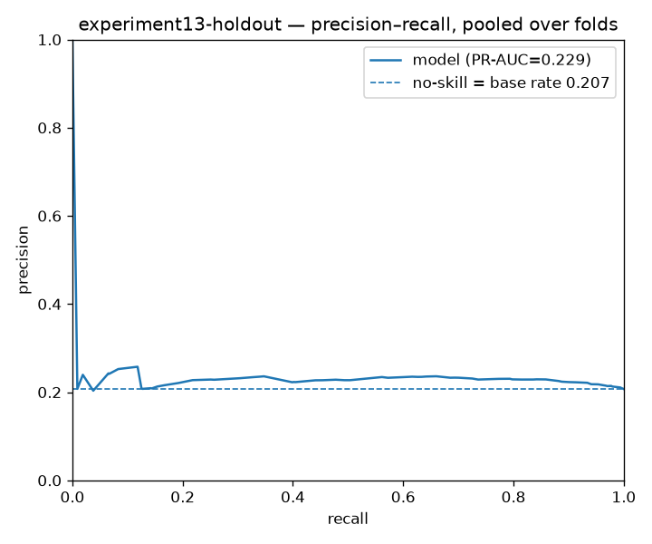
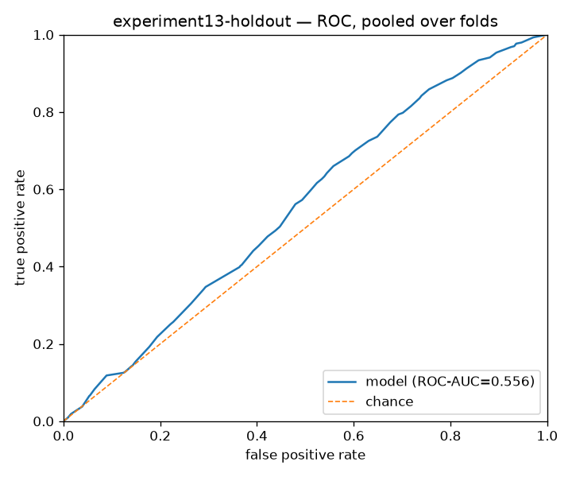
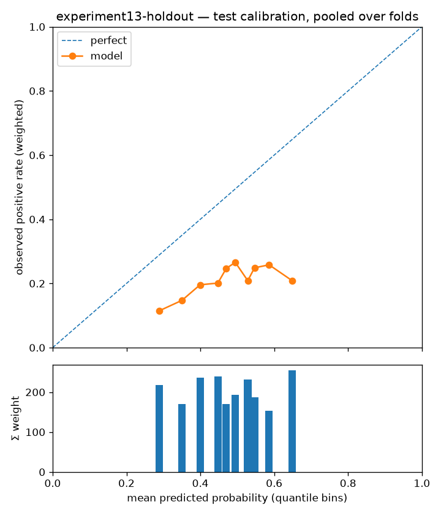

# Experiment report — experiment13-holdout

- run id: `bde2efbf6302`
- dataset version: `1.0` (pinned, immutable)
- config hash: `f9ed15c8cd5f7f3e`
- git SHA: `3e538762292296d1a53cd3d83eb6feb9eebce253`
- seed: 8
- model: `decision_tree` params `{"class_weight": "balanced", "max_depth": 10}`
- label: `label_2y_beat_spy` — horizon 2y, scheme `holdout`
- **configurations tried against this cell (dataset, scheme, horizon, label): 1** (from the append-only results store; failed runs count)

## Fold definition (cited from `split_folds.parquet`)

Frozen fold manifest for the folds evaluated below — boundaries and role counts as built upstream; this report is invalid if the folds are redefined.

| fold | test_start | test_end | embargo_days | n_train | n_test | n_purged | n_embargoed |
| --- | --- | --- | --- | --- | --- | --- | --- |
| 2022 | 2022-01-01 | 9999-12-31 | 30 | 1212247 | 43789 | 98556 | 3440 |

## Effective sample size

Σ `sample_weight_{H}y` over the rows actually fitted — the honest sample size under overlapping label windows; raw row counts are shown only for reconciliation.

| fold | train_rows | effective_train_size | test_rows |
| --- | --- | --- | --- |
| 2022 | 1212247 | 58073.6854 | 43789 |

Cross-check: `manifest.json["effective_rows"]` for 2y = 69247.5 (whole dataset; every per-fold effective size above must be ≤ this).

## Metrics per fold (era-sliced)

One row per walk-forward fold = one test year; pooled numbers are never presented alone. Brier is reported only for probabilistic scores; ROC-AUC is logged, never headline.

| fold | n_test | base_rate | pr_auc | roc_auc | brier | precision_at_15 | recall_at_15 | precision_at_thr_0.5 | recall_at_thr_0.5 | n_at_thr_0.5 | precision_at_thr_0.7 | recall_at_thr_0.7 | n_at_thr_0.7 |
| --- | --- | --- | --- | --- | --- | --- | --- | --- | --- | --- | --- | --- | --- |
| 2022 | 43789 | 0.2071 | 0.2287 | 0.5558 | 0.2413 | 0.3333 | 0.0005 | 0.2418 | 0.4693 | 18706 | 0.2222 | 0.0093 | 405 |

## Era-sliced metrics (per test year)

Sliced on the calendar year of each test row's `snapshot_date`. The pooled row is context for the era rows, never a stand-alone result.

| era | n_test | effective_n | base_rate | pr_auc | roc_auc | brier | precision_at_15 | recall_at_15 | precision_at_thr_0.5 | recall_at_thr_0.5 | n_at_thr_0.5 | precision_at_thr_0.7 | recall_at_thr_0.7 | n_at_thr_0.7 |
| --- | --- | --- | --- | --- | --- | --- | --- | --- | --- | --- | --- | --- | --- | --- |
| 2022 | 18415 | 878.9086 | 0.2124 | 0.2362 | 0.5621 | 0.2455 | 0 | 0 | 0.2559 | 0.5284 | 8572 | 0.2051 | 0.0058 | 117 |
| 2023 | 17019 | 790.5184 | 0.1890 | 0.2027 | 0.5370 | 0.2377 | 0.2667 | 0.0012 | 0.2047 | 0.3961 | 6623 | 0.2234 | 0.0129 | 197 |
| 2024 | 8355 | 385.3285 | 0.2323 | 0.2640 | 0.5698 | 0.2394 | 0.2667 | 0.0019 | 0.2774 | 0.4719 | 3511 | 0.2418 | 0.0107 | 91 |
| pooled | 43789 | 2054.7555 | 0.2071 | 0.2287 | 0.5558 | 0.2413 | 0.3333 | 0.0005 | 0.2418 | 0.4693 | 18706 | 0.2222 | 0.0093 | 405 |

## Crash-era metrics

Drawdown eras broken out separately — the defensive thesis is only testable here. Intervals are Wilson 95% on precision@K treating the K picks as independent; they are not — same-year picks share sectors, factor bets and overlapping windows, so true uncertainty is wider than shown.

| era | n_test | effective_n | base_rate | pr_auc | roc_auc | brier | precision_at_15 | recall_at_15 | precision_at_thr_0.5 | recall_at_thr_0.5 | n_at_thr_0.5 | precision_at_thr_0.7 | recall_at_thr_0.7 | n_at_thr_0.7 | precision_at_15_ci95 |
| --- | --- | --- | --- | --- | --- | --- | --- | --- | --- | --- | --- | --- | --- | --- | --- |
| rate-shock 2022 | 18415 | 878.9086 | 0.2124 | 0.2362 | 0.5621 | 0.2455 | 0 | 0 | 0.2559 | 0.5284 | 8572 | 0.2051 | 0.0058 | 117 | [0.00, 0.20] |

## Discrimination curves

Pooled over folds. Read precision–recall against the base rate (the no-skill line moves with prevalence, which is extreme in some cells); ROC is logged against the chance diagonal but never headlined (CLAUDE.md) — PR-AUC is the metric of record.

## Calibration

Reliability curve on pooled test predictions (each fold's model is refit on its own expanding window). Downstream ranking trusts these probabilities; single trees are expected to calibrate poorly (known Phase-1 limitation, PLAN §2).

## Baseline comparison

**No baseline runs recorded for this cell.** Run `scripts/run_baselines.py` first; a result without its baselines is not reportable.

## Interpretability artifacts

- extracted rules (one tree per fold): [experiment13-holdout_rules.md](experiment13-holdout_rules.md)
- tree diagram (fold 2022, the widest training window): [experiment13-holdout_tree.png](experiment13-holdout_tree.png)
