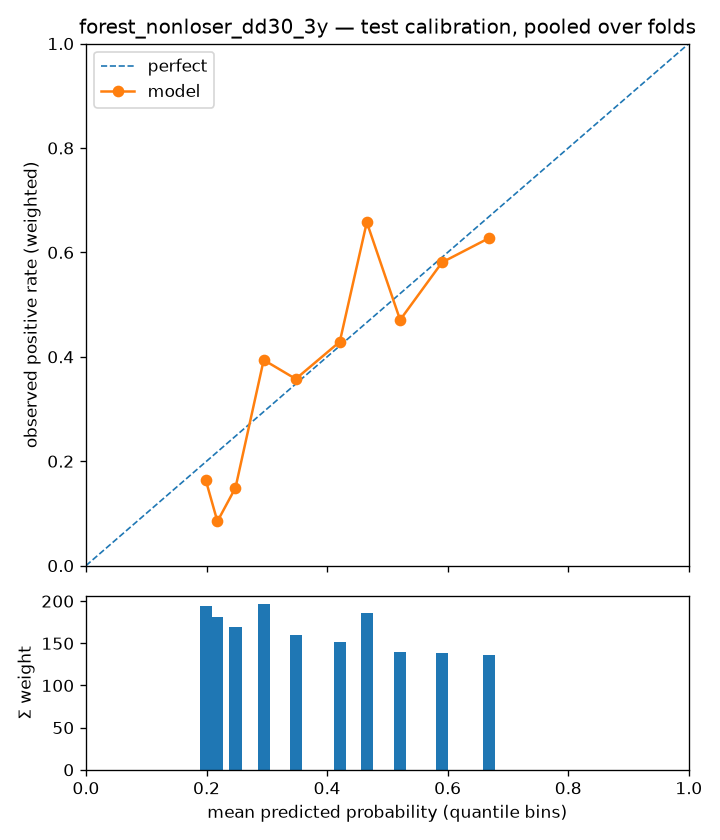

# Experiment report — forest_nonloser_dd30_3y

- run id: `b6707d087996`
- dataset version: `1.4` (pinned, immutable)
- config hash: `419b84929382132f`
- git SHA: `62e021d2833e91c03157cc852f37df26d8a84f3f`
- seed: 23
- model: `random_forest` params `{"bootstrap": true, "class_weight": 1.0, "criterion": "entropy", "max_depth": 4, "max_features": 0.205191, "max_samples": 0.663781, "min_samples_leaf": 72, "n_estimators": 490, "n_jobs": 8}`
- label: `fwd_3y_cagr >= 0.0 & fwd_3y_max_drawdown_from_entry < 0.3` — horizon 3y, scheme `holdout`
- derived label `fwd_3y_cagr >= 0.0 & fwd_3y_max_drawdown_from_entry < 0.3`: evaluated on the fly from the manifest's continuous outcome columns (harness.derived_labels); NULL wherever a referenced column is NULL
- **configurations tried against this cell (dataset, scheme, horizon, label): 1** (from the append-only results store; failed runs count)

## Era-sliced metrics (one row per test year)

Sliced on the calendar year of each test row's `snapshot_date` (one walk-forward fold per year); crash eras are tagged inline. `conf_at_K` is the mean score of the top-K picks; `base_rate_brier` is the no-skill Brier the model must beat. \*The pooled row picks per year — per-fold model scores are not comparable, so a global top-K would just take the hottest-scoring fold's picks; it is context for the era rows, never a stand-alone result. ROC-AUC and recall@K are logged in the results store, not shown here.

| era               | n_test | base_rate | precision_at_20 | precision_at_10 | precision_at_5 | precision_at_50 | precision_at_100 | precision_at_thr_0.6 | precision_at_thr_0.7 | precision_at_thr_0.75 | precision_at_thr_0.8 | conf_at_20 | conf_at_10 | conf_at_5 | conf_at_50 | conf_at_100 | n_at_prec_0.75 | n_at_prec_0.9 | recall_at_prec_0.75 | recall_at_prec_0.9 | recall_at_thr_0.6 | recall_at_thr_0.7 | recall_at_thr_0.75 | recall_at_thr_0.8 | n_at_thr_0.6 | n_at_thr_0.7 | n_at_thr_0.75 | n_at_thr_0.8 | brier  | base_rate_brier | pr_auc |
| ----------------- | ------ | --------- | --------------- | --------------- | -------------- | --------------- | ---------------- | -------------------- | -------------------- | --------------------- | -------------------- | ---------- | ---------- | --------- | ---------- | ----------- | -------------- | ------------- | ------------------- | ------------------ | ----------------- | ----------------- | ------------------ | ----------------- | ------------ | ------------ | ------------- | ------------ | ------ | --------------- | ------ |
| 2021              | 17414  | 0.3379    | 0.7500          | 0.7000          | 0.8000         | 0.7600          | 0.7000           | 0.5426               | 0.6211               | —                     | —                    | 0.7304     | 0.7321     | 0.7335    | 0.7269     | 0.7239      | 76             | 4             | 0.0106              | 0.0007             | 0.2413            | 0.0438            | 0                  | 0                 | 2394         | 380          | 0             | 0            | 0.2093 | 0.2237          | 0.4845 |
| 2022 (rate-shock) | 18267  | 0.4079    | 0.6500          | 0.7000          | 0.4000         | 0.7000          | 0.6700           | 0.6207               | 0.6570               | —                     | —                    | 0.7231     | 0.7242     | 0.7254    | 0.7205     | 0.7173      | 32             | 0             | 0.0036              | 0                  | 0.2247            | 0.0236            | 0                  | 0                 | 2436         | 242          | 0             | 0            | 0.2066 | 0.2415          | 0.5962 |
| 2023              | 11331  | 0.3991    | 0.5500          | 0.4000          | 0.4000         | 0.7200          | 0.7100           | 0.6794               | 0.7120               | —                     | —                    | 0.7234     | 0.7256     | 0.7267    | 0.7200     | 0.7161      | 72             | 0             | 0.0127              | 0                  | 0.2569            | 0.0309            | 0                  | 0                 | 1603         | 184          | 0             | 0            | 0.1959 | 0.2398          | 0.6300 |
| pooled*           | 47012  | 0.3789    | 0.6500          | 0.6000          | 0.5333         | 0.7267          | 0.6933           | 0.6062               | 0.6526               | —                     | —                    | 0.7256     | 0.7273     | 0.7285    | 0.7225     | 0.7191      | 180            | 4             | 0.0083              | 0.0002             | 0.2385            | 0.0322            | 0                  | 0                 | 6433         | 806          | 0             | 0            | 0.2052 | 0.2353          | 0.5636 |

## High-confidence picks (pooled)

How many high-confidence calls the model made, how confident it was, and how precise they were — no pre-chosen score threshold needed. `top N/yr` rows pick per test year; `score >= p` rows (probabilistic models) count every name at or above that probability, pooled.

| selection    | n_picks | picks_per_year | mean_score | precision | hits |
| ------------ | ------- | -------------- | ---------- | --------- | ---- |
| top 5/yr     | 15      | 5              | 0.7285     | 0.5333    | 8    |
| top 10/yr    | 30      | 10             | 0.7273     | 0.6000    | 18   |
| top 20/yr    | 60      | 20             | 0.7256     | 0.6500    | 39   |
| top 50/yr    | 150     | 50             | 0.7225     | 0.7267    | 109  |
| score >= 0.9 | 0       | 0              | —          | —         | 0    |
| score >= 0.8 | 0       | 0              | —          | —         | 0    |
| score >= 0.7 | 806     | 268.7000       | 0.7115     | 0.6526    | 526  |
| score >= 0.6 | 6433    | 2144.3000      | 0.6544     | 0.6062    | 3900 |
| score >= 0.5 | 13247   | 4415.7000      | 0.6004     | 0.5520    | 7313 |

## Pick outcomes (what the picks went on to do)

Report-only outcomes of the top-K picks of each test year (`pick_outcomes`: `label_3y_beat_spy`, `fwd_3y_excess_cagr`, `fwd_3y_cagr`, `fwd_3y_max_drawdown_from_entry`, `fwd_3y_cagr < 0.0`, `fwd_3y_cagr < -0.1`, `fwd_3y_max_drawdown_from_entry >= 0.4`, `fwd_3y_cagr >= 0.15`, `fwd_3y_cagr >= 0.25`, `fwd_3y_excess_cagr >= 0.05`), from the manifest's label columns; none is a model input or the training target, and the run is counted in its own label's cell. For a binary outcome the picks' hit rate, for a continuous one their mean and median, each beside the same statistic over **all** test rows of the era (unweighted, like the picks: one row, one pick). `stocks` is the number of distinct `permaticker`s among the picks (a stock has up to four test rows a year); in the pooled row it is the mean per year and the statistics run over every year's picks. NULL outcomes are left out, not counted as misses. This is a no-cost, equal-weight reading of the picks, a screen for `vml-backtest` and not a substitute.

### Top 20 per test year: `label_3y_beat_spy`

| era               | picks | stocks  | picks hit rate | all rows |
| ----------------- | ----- | ------- | -------------- | -------- |
| 2021              | 20    | 12      | 0.4000         | 0.1951   |
| 2022 (rate-shock) | 20    | 15      | 0.1500         | 0.1758   |
| 2023              | 20    | 16      | 0              | 0.1842   |
| pooled*           | 60    | 14.3333 | 0.1833         | 0.1850   |

### Top 20 per test year: `fwd_3y_excess_cagr`

| era               | picks | stocks  | picks mean | picks median | all rows mean | all rows median |
| ----------------- | ----- | ------- | ---------- | ------------ | ------------- | --------------- |
| 2021              | 20    | 12      | -0.0224    | -0.0290      | -0.2423       | -0.1570         |
| 2022 (rate-shock) | 20    | 15      | -0.0765    | -0.0789      | -0.2522       | -0.1903         |
| 2023              | 20    | 16      | -0.1768    | -0.1675      | -0.2614       | -0.2086         |
| pooled*           | 60    | 14.3333 | -0.0919    | -0.0796      | -0.2507       | -0.1898         |

### Top 20 per test year: `fwd_3y_cagr`

| era               | picks | stocks  | picks mean | picks median | all rows mean | all rows median |
| ----------------- | ----- | ------- | ---------- | ------------ | ------------- | --------------- |
| 2021              | 20    | 12      | 0.0724     | 0.0623       | -0.1471       | -0.0611         |
| 2022 (rate-shock) | 20    | 15      | 0.0466     | 0.0455       | -0.0918       | -0.0099         |
| 2023              | 20    | 16      | 0.0298     | 0.0366       | -0.0524       | 0.0013          |
| pooled*           | 60    | 14.3333 | 0.0496     | 0.0482       | -0.1028       | -0.0232         |

### Top 20 per test year: `fwd_3y_max_drawdown_from_entry`

| era               | picks | stocks  | picks mean | picks median | all rows mean | all rows median |
| ----------------- | ----- | ------- | ---------- | ------------ | ------------- | --------------- |
| 2021              | 20    | 12      | 0.1491     | 0.1096       | 0.5081        | 0.5001          |
| 2022 (rate-shock) | 20    | 15      | 0.1815     | 0.1785       | 0.4607        | 0.4109          |
| 2023              | 20    | 16      | 0.1958     | 0.1558       | 0.4520        | 0.4111          |
| pooled*           | 60    | 14.3333 | 0.1755     | 0.1498       | 0.4762        | 0.4415          |

### Top 20 per test year: `label_3y_cagr_lt_0p0`

| era               | picks | stocks  | picks hit rate | all rows |
| ----------------- | ----- | ------- | -------------- | -------- |
| 2021              | 20    | 12      | 0.1500         | 0.5892   |
| 2022 (rate-shock) | 20    | 15      | 0.3000         | 0.5146   |
| 2023              | 20    | 16      | 0.4000         | 0.4872   |
| pooled*           | 60    | 14.3333 | 0.2833         | 0.5356   |

### Top 20 per test year: `label_3y_cagr_lt_m0p1`

| era               | picks | stocks  | picks hit rate | all rows |
| ----------------- | ----- | ------- | -------------- | -------- |
| 2021              | 20    | 12      | 0.0500         | 0.4568   |
| 2022 (rate-shock) | 20    | 15      | 0              | 0.3942   |
| 2023              | 20    | 16      | 0.1000         | 0.3731   |
| pooled*           | 60    | 14.3333 | 0.0500         | 0.4123   |

### Top 20 per test year: `label_3y_max_drawdown_from_entry_ge_0p4`

| era               | picks | stocks  | picks hit rate | all rows |
| ----------------- | ----- | ------- | -------------- | -------- |
| 2021              | 20    | 12      | 0.0500         | 0.5664   |
| 2022 (rate-shock) | 20    | 15      | 0              | 0.5084   |
| 2023              | 20    | 16      | 0.1000         | 0.5091   |
| pooled*           | 60    | 14.3333 | 0.0500         | 0.5301   |

### Top 20 per test year: `label_3y_cagr_ge_0p15`

| era               | picks | stocks  | picks hit rate | all rows |
| ----------------- | ----- | ------- | -------------- | -------- |
| 2021              | 20    | 12      | 0.2000         | 0.1372   |
| 2022 (rate-shock) | 20    | 15      | 0.1500         | 0.1853   |
| 2023              | 20    | 16      | 0.1000         | 0.2374   |
| pooled*           | 60    | 14.3333 | 0.1500         | 0.1800   |

### Top 20 per test year: `label_3y_cagr_ge_0p25`

| era               | picks | stocks  | picks hit rate | all rows |
| ----------------- | ----- | ------- | -------------- | -------- |
| 2021              | 20    | 12      | 0              | 0.0713   |
| 2022 (rate-shock) | 20    | 15      | 0              | 0.1094   |
| 2023              | 20    | 16      | 0              | 0.1526   |
| pooled*           | 60    | 14.3333 | 0              | 0.1057   |

### Top 20 per test year: `label_3y_excess_cagr_ge_0p05`

| era               | picks | stocks  | picks hit rate | all rows |
| ----------------- | ----- | ------- | -------------- | -------- |
| 2021              | 20    | 12      | 0.2500         | 0.1424   |
| 2022 (rate-shock) | 20    | 15      | 0.1000         | 0.1343   |
| 2023              | 20    | 16      | 0              | 0.1459   |
| pooled*           | 60    | 14.3333 | 0.1167         | 0.1401   |

### Top 10 per test year: `label_3y_beat_spy`

| era               | picks | stocks | picks hit rate | all rows |
| ----------------- | ----- | ------ | -------------- | -------- |
| 2021              | 10    | 6      | 0.5000         | 0.1951   |
| 2022 (rate-shock) | 10    | 7      | 0.2000         | 0.1758   |
| 2023              | 10    | 8      | 0              | 0.1842   |
| pooled*           | 30    | 7      | 0.2333         | 0.1850   |

### Top 10 per test year: `fwd_3y_excess_cagr`

| era               | picks | stocks | picks mean | picks median | all rows mean | all rows median |
| ----------------- | ----- | ------ | ---------- | ------------ | ------------- | --------------- |
| 2021              | 10    | 6      | -0.0158    | -0.0002      | -0.2423       | -0.1570         |
| 2022 (rate-shock) | 10    | 7      | -0.0671    | -0.0766      | -0.2522       | -0.1903         |
| 2023              | 10    | 8      | -0.2152    | -0.2550      | -0.2614       | -0.2086         |
| pooled*           | 30    | 7      | -0.0994    | -0.0816      | -0.2507       | -0.1898         |

### Top 10 per test year: `fwd_3y_cagr`

| era               | picks | stocks | picks mean | picks median | all rows mean | all rows median |
| ----------------- | ----- | ------ | ---------- | ------------ | ------------- | --------------- |
| 2021              | 10    | 6      | 0.0762     | 0.0878       | -0.1471       | -0.0611         |
| 2022 (rate-shock) | 10    | 7      | 0.0617     | 0.0458       | -0.0918       | -0.0099         |
| 2023              | 10    | 8      | -0.0044    | -0.0358      | -0.0524       | 0.0013          |
| pooled*           | 30    | 7      | 0.0445     | 0.0458       | -0.1028       | -0.0232         |

### Top 10 per test year: `fwd_3y_max_drawdown_from_entry`

| era               | picks | stocks | picks mean | picks median | all rows mean | all rows median |
| ----------------- | ----- | ------ | ---------- | ------------ | ------------- | --------------- |
| 2021              | 10    | 6      | 0.1494     | 0.0504       | 0.5081        | 0.5001          |
| 2022 (rate-shock) | 10    | 7      | 0.1476     | 0.1528       | 0.4607        | 0.4109          |
| 2023              | 10    | 8      | 0.2464     | 0.2470       | 0.4520        | 0.4111          |
| pooled*           | 30    | 7      | 0.1811     | 0.1498       | 0.4762        | 0.4415          |

### Top 10 per test year: `label_3y_cagr_lt_0p0`

| era               | picks | stocks | picks hit rate | all rows |
| ----------------- | ----- | ------ | -------------- | -------- |
| 2021              | 10    | 6      | 0.2000         | 0.5892   |
| 2022 (rate-shock) | 10    | 7      | 0.3000         | 0.5146   |
| 2023              | 10    | 8      | 0.6000         | 0.4872   |
| pooled*           | 30    | 7      | 0.3667         | 0.5356   |

### Top 10 per test year: `label_3y_cagr_lt_m0p1`

| era               | picks | stocks | picks hit rate | all rows |
| ----------------- | ----- | ------ | -------------- | -------- |
| 2021              | 10    | 6      | 0.1000         | 0.4568   |
| 2022 (rate-shock) | 10    | 7      | 0              | 0.3942   |
| 2023              | 10    | 8      | 0.2000         | 0.3731   |
| pooled*           | 30    | 7      | 0.1000         | 0.4123   |

### Top 10 per test year: `label_3y_max_drawdown_from_entry_ge_0p4`

| era               | picks | stocks | picks hit rate | all rows |
| ----------------- | ----- | ------ | -------------- | -------- |
| 2021              | 10    | 6      | 0.1000         | 0.5664   |
| 2022 (rate-shock) | 10    | 7      | 0              | 0.5084   |
| 2023              | 10    | 8      | 0.2000         | 0.5091   |
| pooled*           | 30    | 7      | 0.1000         | 0.5301   |

### Top 10 per test year: `label_3y_cagr_ge_0p15`

| era               | picks | stocks | picks hit rate | all rows |
| ----------------- | ----- | ------ | -------------- | -------- |
| 2021              | 10    | 6      | 0.3000         | 0.1372   |
| 2022 (rate-shock) | 10    | 7      | 0.2000         | 0.1853   |
| 2023              | 10    | 8      | 0.1000         | 0.2374   |
| pooled*           | 30    | 7      | 0.2000         | 0.1800   |

### Top 10 per test year: `label_3y_cagr_ge_0p25`

| era               | picks | stocks | picks hit rate | all rows |
| ----------------- | ----- | ------ | -------------- | -------- |
| 2021              | 10    | 6      | 0              | 0.0713   |
| 2022 (rate-shock) | 10    | 7      | 0              | 0.1094   |
| 2023              | 10    | 8      | 0              | 0.1526   |
| pooled*           | 30    | 7      | 0              | 0.1057   |

### Top 10 per test year: `label_3y_excess_cagr_ge_0p05`

| era               | picks | stocks | picks hit rate | all rows |
| ----------------- | ----- | ------ | -------------- | -------- |
| 2021              | 10    | 6      | 0.4000         | 0.1424   |
| 2022 (rate-shock) | 10    | 7      | 0.2000         | 0.1343   |
| 2023              | 10    | 8      | 0              | 0.1459   |
| pooled*           | 30    | 7      | 0.2000         | 0.1401   |

### Top 5 per test year: `label_3y_beat_spy`

| era               | picks | stocks | picks hit rate | all rows |
| ----------------- | ----- | ------ | -------------- | -------- |
| 2021              | 5     | 3      | 0.8000         | 0.1951   |
| 2022 (rate-shock) | 5     | 5      | 0              | 0.1758   |
| 2023              | 5     | 5      | 0              | 0.1842   |
| pooled*           | 15    | 4.3333 | 0.2667         | 0.1850   |

### Top 5 per test year: `fwd_3y_excess_cagr`

| era               | picks | stocks | picks mean | picks median | all rows mean | all rows median |
| ----------------- | ----- | ------ | ---------- | ------------ | ------------- | --------------- |
| 2021              | 5     | 3      | 0.0145     | 0.0568       | -0.2423       | -0.1570         |
| 2022 (rate-shock) | 5     | 5      | -0.1135    | -0.1407      | -0.2522       | -0.1903         |
| 2023              | 5     | 5      | -0.1968    | -0.2491      | -0.2614       | -0.2086         |
| pooled*           | 15    | 4.3333 | -0.0986    | -0.0855      | -0.2507       | -0.1898         |

### Top 5 per test year: `fwd_3y_cagr`

| era               | picks | stocks | picks mean | picks median | all rows mean | all rows median |
| ----------------- | ----- | ------ | ---------- | ------------ | ------------- | --------------- |
| 2021              | 5     | 3      | 0.1118     | 0.1552       | -0.1471       | -0.0611         |
| 2022 (rate-shock) | 5     | 5      | 0.0123     | -0.0107      | -0.0918       | -0.0099         |
| 2023              | 5     | 5      | 0.0090     | -0.0303      | -0.0524       | 0.0013          |
| pooled*           | 15    | 4.3333 | 0.0444     | 0.0431       | -0.1028       | -0.0232         |

### Top 5 per test year: `fwd_3y_max_drawdown_from_entry`

| era               | picks | stocks | picks mean | picks median | all rows mean | all rows median |
| ----------------- | ----- | ------ | ---------- | ------------ | ------------- | --------------- |
| 2021              | 5     | 3      | 0.1391     | 0.0310       | 0.5081        | 0.5001          |
| 2022 (rate-shock) | 5     | 5      | 0.1540     | 0.1560       | 0.4607        | 0.4109          |
| 2023              | 5     | 5      | 0.2001     | 0.2423       | 0.4520        | 0.4111          |
| pooled*           | 15    | 4.3333 | 0.1644     | 0.1501       | 0.4762        | 0.4415          |

### Top 5 per test year: `label_3y_cagr_lt_0p0`

| era               | picks | stocks | picks hit rate | all rows |
| ----------------- | ----- | ------ | -------------- | -------- |
| 2021              | 5     | 3      | 0.2000         | 0.5892   |
| 2022 (rate-shock) | 5     | 5      | 0.6000         | 0.5146   |
| 2023              | 5     | 5      | 0.6000         | 0.4872   |
| pooled*           | 15    | 4.3333 | 0.4667         | 0.5356   |

### Top 5 per test year: `label_3y_cagr_lt_m0p1`

| era               | picks | stocks | picks hit rate | all rows |
| ----------------- | ----- | ------ | -------------- | -------- |
| 2021              | 5     | 3      | 0.2000         | 0.4568   |
| 2022 (rate-shock) | 5     | 5      | 0              | 0.3942   |
| 2023              | 5     | 5      | 0.2000         | 0.3731   |
| pooled*           | 15    | 4.3333 | 0.1333         | 0.4123   |

### Top 5 per test year: `label_3y_max_drawdown_from_entry_ge_0p4`

| era               | picks | stocks | picks hit rate | all rows |
| ----------------- | ----- | ------ | -------------- | -------- |
| 2021              | 5     | 3      | 0.2000         | 0.5664   |
| 2022 (rate-shock) | 5     | 5      | 0              | 0.5084   |
| 2023              | 5     | 5      | 0              | 0.5091   |
| pooled*           | 15    | 4.3333 | 0.0667         | 0.5301   |

### Top 5 per test year: `label_3y_cagr_ge_0p15`

| era               | picks | stocks | picks hit rate | all rows |
| ----------------- | ----- | ------ | -------------- | -------- |
| 2021              | 5     | 3      | 0.6000         | 0.1372   |
| 2022 (rate-shock) | 5     | 5      | 0              | 0.1853   |
| 2023              | 5     | 5      | 0              | 0.2374   |
| pooled*           | 15    | 4.3333 | 0.2000         | 0.1800   |

### Top 5 per test year: `label_3y_cagr_ge_0p25`

| era               | picks | stocks | picks hit rate | all rows |
| ----------------- | ----- | ------ | -------------- | -------- |
| 2021              | 5     | 3      | 0              | 0.0713   |
| 2022 (rate-shock) | 5     | 5      | 0              | 0.1094   |
| 2023              | 5     | 5      | 0              | 0.1526   |
| pooled*           | 15    | 4.3333 | 0              | 0.1057   |

### Top 5 per test year: `label_3y_excess_cagr_ge_0p05`

| era               | picks | stocks | picks hit rate | all rows |
| ----------------- | ----- | ------ | -------------- | -------- |
| 2021              | 5     | 3      | 0.6000         | 0.1424   |
| 2022 (rate-shock) | 5     | 5      | 0              | 0.1343   |
| 2023              | 5     | 5      | 0              | 0.1459   |
| pooled*           | 15    | 4.3333 | 0.2000         | 0.1401   |

### Top 50 per test year: `label_3y_beat_spy`

| era               | picks | stocks  | picks hit rate | all rows |
| ----------------- | ----- | ------- | -------------- | -------- |
| 2021              | 50    | 30      | 0.3200         | 0.1951   |
| 2022 (rate-shock) | 50    | 30      | 0.1400         | 0.1758   |
| 2023              | 50    | 34      | 0.0600         | 0.1842   |
| pooled*           | 150   | 31.3333 | 0.1733         | 0.1850   |

### Top 50 per test year: `fwd_3y_excess_cagr`

| era               | picks | stocks  | picks mean | picks median | all rows mean | all rows median |
| ----------------- | ----- | ------- | ---------- | ------------ | ------------- | --------------- |
| 2021              | 50    | 30      | -0.0338    | -0.0377      | -0.2423       | -0.1570         |
| 2022 (rate-shock) | 50    | 30      | -0.0889    | -0.0878      | -0.2522       | -0.1903         |
| 2023              | 50    | 34      | -0.1546    | -0.1266      | -0.2614       | -0.2086         |
| pooled*           | 150   | 31.3333 | -0.0924    | -0.0812      | -0.2507       | -0.1898         |

### Top 50 per test year: `fwd_3y_cagr`

| era               | picks | stocks  | picks mean | picks median | all rows mean | all rows median |
| ----------------- | ----- | ------- | ---------- | ------------ | ------------- | --------------- |
| 2021              | 50    | 30      | 0.0615     | 0.0586       | -0.1471       | -0.0611         |
| 2022 (rate-shock) | 50    | 30      | 0.0416     | 0.0488       | -0.0918       | -0.0099         |
| 2023              | 50    | 34      | 0.0521     | 0.0773       | -0.0524       | 0.0013          |
| pooled*           | 150   | 31.3333 | 0.0517     | 0.0551       | -0.1028       | -0.0232         |

### Top 50 per test year: `fwd_3y_max_drawdown_from_entry`

| era               | picks | stocks  | picks mean | picks median | all rows mean | all rows median |
| ----------------- | ----- | ------- | ---------- | ------------ | ------------- | --------------- |
| 2021              | 50    | 30      | 0.1617     | 0.1301       | 0.5081        | 0.5001          |
| 2022 (rate-shock) | 50    | 30      | 0.1787     | 0.1586       | 0.4607        | 0.4109          |
| 2023              | 50    | 34      | 0.1839     | 0.1469       | 0.4520        | 0.4111          |
| pooled*           | 150   | 31.3333 | 0.1747     | 0.1498       | 0.4762        | 0.4415          |

### Top 50 per test year: `label_3y_cagr_lt_0p0`

| era               | picks | stocks  | picks hit rate | all rows |
| ----------------- | ----- | ------- | -------------- | -------- |
| 2021              | 50    | 30      | 0.1800         | 0.5892   |
| 2022 (rate-shock) | 50    | 30      | 0.2800         | 0.5146   |
| 2023              | 50    | 34      | 0.2600         | 0.4872   |
| pooled*           | 150   | 31.3333 | 0.2400         | 0.5356   |

### Top 50 per test year: `label_3y_cagr_lt_m0p1`

| era               | picks | stocks  | picks hit rate | all rows |
| ----------------- | ----- | ------- | -------------- | -------- |
| 2021              | 50    | 30      | 0.0600         | 0.4568   |
| 2022 (rate-shock) | 50    | 30      | 0              | 0.3942   |
| 2023              | 50    | 34      | 0.1000         | 0.3731   |
| pooled*           | 150   | 31.3333 | 0.0533         | 0.4123   |

### Top 50 per test year: `label_3y_max_drawdown_from_entry_ge_0p4`

| era               | picks | stocks  | picks hit rate | all rows |
| ----------------- | ----- | ------- | -------------- | -------- |
| 2021              | 50    | 30      | 0.0800         | 0.5664   |
| 2022 (rate-shock) | 50    | 30      | 0.0200         | 0.5084   |
| 2023              | 50    | 34      | 0.1000         | 0.5091   |
| pooled*           | 150   | 31.3333 | 0.0667         | 0.5301   |

### Top 50 per test year: `label_3y_cagr_ge_0p15`

| era               | picks | stocks  | picks hit rate | all rows |
| ----------------- | ----- | ------- | -------------- | -------- |
| 2021              | 50    | 30      | 0.1400         | 0.1372   |
| 2022 (rate-shock) | 50    | 30      | 0.1000         | 0.1853   |
| 2023              | 50    | 34      | 0.1600         | 0.2374   |
| pooled*           | 150   | 31.3333 | 0.1333         | 0.1800   |

### Top 50 per test year: `label_3y_cagr_ge_0p25`

| era               | picks | stocks  | picks hit rate | all rows |
| ----------------- | ----- | ------- | -------------- | -------- |
| 2021              | 50    | 30      | 0              | 0.0713   |
| 2022 (rate-shock) | 50    | 30      | 0              | 0.1094   |
| 2023              | 50    | 34      | 0              | 0.1526   |
| pooled*           | 150   | 31.3333 | 0              | 0.1057   |

### Top 50 per test year: `label_3y_excess_cagr_ge_0p05`

| era               | picks | stocks  | picks hit rate | all rows |
| ----------------- | ----- | ------- | -------------- | -------- |
| 2021              | 50    | 30      | 0.1600         | 0.1424   |
| 2022 (rate-shock) | 50    | 30      | 0.0400         | 0.1343   |
| 2023              | 50    | 34      | 0              | 0.1459   |
| pooled*           | 150   | 31.3333 | 0.0667         | 0.1401   |

### Top 100 per test year: `label_3y_beat_spy`

| era               | picks | stocks  | picks hit rate | all rows |
| ----------------- | ----- | ------- | -------------- | -------- |
| 2021              | 100   | 49      | 0.2700         | 0.1951   |
| 2022 (rate-shock) | 100   | 47      | 0.1100         | 0.1758   |
| 2023              | 100   | 62      | 0.0700         | 0.1842   |
| pooled*           | 300   | 52.6667 | 0.1500         | 0.1850   |

### Top 100 per test year: `fwd_3y_excess_cagr`

| era               | picks | stocks  | picks mean | picks median | all rows mean | all rows median |
| ----------------- | ----- | ------- | ---------- | ------------ | ------------- | --------------- |
| 2021              | 100   | 49      | -0.0438    | -0.0468      | -0.2423       | -0.1570         |
| 2022 (rate-shock) | 100   | 47      | -0.1115    | -0.1079      | -0.2522       | -0.1903         |
| 2023              | 100   | 62      | -0.1486    | -0.1266      | -0.2614       | -0.2086         |
| pooled*           | 300   | 52.6667 | -0.1013    | -0.0928      | -0.2507       | -0.1898         |

### Top 100 per test year: `fwd_3y_cagr`

| era               | picks | stocks  | picks mean | picks median | all rows mean | all rows median |
| ----------------- | ----- | ------- | ---------- | ------------ | ------------- | --------------- |
| 2021              | 100   | 49      | 0.0506     | 0.0489       | -0.1471       | -0.0611         |
| 2022 (rate-shock) | 100   | 47      | 0.0352     | 0.0451       | -0.0918       | -0.0099         |
| 2023              | 100   | 62      | 0.0603     | 0.0838       | -0.0524       | 0.0013          |
| pooled*           | 300   | 52.6667 | 0.0487     | 0.0542       | -0.1028       | -0.0232         |

### Top 100 per test year: `fwd_3y_max_drawdown_from_entry`

| era               | picks | stocks  | picks mean | picks median | all rows mean | all rows median |
| ----------------- | ----- | ------- | ---------- | ------------ | ------------- | --------------- |
| 2021              | 100   | 49      | 0.1769     | 0.1524       | 0.5081        | 0.5001          |
| 2022 (rate-shock) | 100   | 47      | 0.1997     | 0.1846       | 0.4607        | 0.4109          |
| 2023              | 100   | 62      | 0.1802     | 0.1469       | 0.4520        | 0.4111          |
| pooled*           | 300   | 52.6667 | 0.1856     | 0.1568       | 0.4762        | 0.4415          |

### Top 100 per test year: `label_3y_cagr_lt_0p0`

| era               | picks | stocks  | picks hit rate | all rows |
| ----------------- | ----- | ------- | -------------- | -------- |
| 2021              | 100   | 49      | 0.2400         | 0.5892   |
| 2022 (rate-shock) | 100   | 47      | 0.3100         | 0.5146   |
| 2023              | 100   | 62      | 0.2800         | 0.4872   |
| pooled*           | 300   | 52.6667 | 0.2767         | 0.5356   |

### Top 100 per test year: `label_3y_cagr_lt_m0p1`

| era               | picks | stocks  | picks hit rate | all rows |
| ----------------- | ----- | ------- | -------------- | -------- |
| 2021              | 100   | 49      | 0.0300         | 0.4568   |
| 2022 (rate-shock) | 100   | 47      | 0.0400         | 0.3942   |
| 2023              | 100   | 62      | 0.1000         | 0.3731   |
| pooled*           | 300   | 52.6667 | 0.0567         | 0.4123   |

### Top 100 per test year: `label_3y_max_drawdown_from_entry_ge_0p4`

| era               | picks | stocks  | picks hit rate | all rows |
| ----------------- | ----- | ------- | -------------- | -------- |
| 2021              | 100   | 49      | 0.0700         | 0.5664   |
| 2022 (rate-shock) | 100   | 47      | 0.0500         | 0.5084   |
| 2023              | 100   | 62      | 0.0900         | 0.5091   |
| pooled*           | 300   | 52.6667 | 0.0700         | 0.5301   |

### Top 100 per test year: `label_3y_cagr_ge_0p15`

| era               | picks | stocks  | picks hit rate | all rows |
| ----------------- | ----- | ------- | -------------- | -------- |
| 2021              | 100   | 49      | 0.1000         | 0.1372   |
| 2022 (rate-shock) | 100   | 47      | 0.0800         | 0.1853   |
| 2023              | 100   | 62      | 0.1900         | 0.2374   |
| pooled*           | 300   | 52.6667 | 0.1233         | 0.1800   |

### Top 100 per test year: `label_3y_cagr_ge_0p25`

| era               | picks | stocks  | picks hit rate | all rows |
| ----------------- | ----- | ------- | -------------- | -------- |
| 2021              | 100   | 49      | 0.0100         | 0.0713   |
| 2022 (rate-shock) | 100   | 47      | 0              | 0.1094   |
| 2023              | 100   | 62      | 0.0100         | 0.1526   |
| pooled*           | 300   | 52.6667 | 0.0067         | 0.1057   |

### Top 100 per test year: `label_3y_excess_cagr_ge_0p05`

| era               | picks | stocks  | picks hit rate | all rows |
| ----------------- | ----- | ------- | -------------- | -------- |
| 2021              | 100   | 49      | 0.1100         | 0.1424   |
| 2022 (rate-shock) | 100   | 47      | 0.0200         | 0.1343   |
| 2023              | 100   | 62      | 0.0100         | 0.1459   |
| pooled*           | 300   | 52.6667 | 0.0467         | 0.1401   |

## Selection by score (every row at or above a threshold)

What every row with `score >= t` went on to do, per test year and pooled, with how many rows and distinct stocks that is. A year with no row at the bar is a year in cash and is shown. Scores of different folds come from different fits: read the picks per year before the pooled row, and read a threshold as a probability only on a calibrated run. Report-only, like the pick outcomes.

### `score >= 0.6`

| era               | picks | of rows | stocks | precision | label_3y_beat_spy hit rate | fwd_3y_excess_cagr mean | fwd_3y_excess_cagr median | fwd_3y_cagr mean | fwd_3y_cagr median | fwd_3y_max_drawdown_from_entry mean | fwd_3y_max_drawdown_from_entry median | label_3y_cagr_lt_0p0 hit rate | label_3y_cagr_lt_m0p1 hit rate | label_3y_max_drawdown_from_entry_ge_0p4 hit rate | label_3y_cagr_ge_0p15 hit rate | label_3y_cagr_ge_0p25 hit rate | label_3y_excess_cagr_ge_0p05 hit rate |
| ----------------- | ----- | ------- | ------ | --------- | -------------------------- | ----------------------- | ------------------------- | ---------------- | ------------------ | ----------------------------------- | ------------------------------------- | ----------------------------- | ------------------------------ | ------------------------------------------------ | ------------------------------ | ------------------------------ | ------------------------------------- |
| 2021              | 2394  | 17414   | 759    | 0.5426    | 0.2916                     | -0.0594                 | -0.0619                   | 0.0355           | 0.0330             | 0.2603                              | 0.2286                                | 0.3680                        | 0.1362                         | 0.2089                                           | 0.1721                         | 0.0673                         | 0.1830                                |
| 2022 (rate-shock) | 2436  | 18267   | 764    | 0.6207    | 0.2336                     | -0.0976                 | -0.1049                   | 0.0632           | 0.0529             | 0.2279                              | 0.1879                                | 0.3300                        | 0.1223                         | 0.1445                                           | 0.2488                         | 0.1121                         | 0.1519                                |
| 2023              | 1603  | 11331   | 714    | 0.6794    | 0.2059                     | -0.1170                 | -0.1262                   | 0.0925           | 0.0821             | 0.2010                              | 0.1470                                | 0.2782                        | 0.1098                         | 0.1372                                           | 0.3057                         | 0.1541                         | 0.1397                                |
| pooled            | 6433  | 47012   | 956    | 0.6062    | 0.2483                     | -0.0882                 | -0.0925                   | 0.0602           | 0.0516             | 0.2333                              | 0.1913                                | 0.3313                        | 0.1244                         | 0.1666                                           | 0.2344                         | 0.1059                         | 0.1604                                |

### `score >= 0.7`

| era               | picks | of rows | stocks | precision | label_3y_beat_spy hit rate | fwd_3y_excess_cagr mean | fwd_3y_excess_cagr median | fwd_3y_cagr mean | fwd_3y_cagr median | fwd_3y_max_drawdown_from_entry mean | fwd_3y_max_drawdown_from_entry median | label_3y_cagr_lt_0p0 hit rate | label_3y_cagr_lt_m0p1 hit rate | label_3y_max_drawdown_from_entry_ge_0p4 hit rate | label_3y_cagr_ge_0p15 hit rate | label_3y_cagr_ge_0p25 hit rate | label_3y_excess_cagr_ge_0p05 hit rate |
| ----------------- | ----- | ------- | ------ | --------- | -------------------------- | ----------------------- | ------------------------- | ---------------- | ------------------ | ----------------------------------- | ------------------------------------- | ----------------------------- | ------------------------------ | ------------------------------------------------ | ------------------------------ | ------------------------------ | ------------------------------------- |
| 2021              | 380   | 17414   | 155    | 0.6211    | 0.2789                     | -0.0437                 | -0.0489                   | 0.0507           | 0.0436             | 0.2040                              | 0.1736                                | 0.3026                        | 0.0553                         | 0.1132                                           | 0.1500                         | 0.0395                         | 0.1605                                |
| 2022 (rate-shock) | 242   | 18267   | 102    | 0.6570    | 0.1198                     | -0.1163                 | -0.1131                   | 0.0385           | 0.0470             | 0.2044                              | 0.1867                                | 0.3140                        | 0.0744                         | 0.0744                                           | 0.1281                         | 0.0124                         | 0.0455                                |
| 2023              | 184   | 11331   | 103    | 0.7120    | 0.1033                     | -0.1417                 | -0.1236                   | 0.0673           | 0.0851             | 0.1749                              | 0.1349                                | 0.2772                        | 0.1033                         | 0.0924                                           | 0.2337                         | 0.0435                         | 0.0326                                |
| pooled            | 806   | 47012   | 216    | 0.6526    | 0.1911                     | -0.0879                 | -0.0835                   | 0.0508           | 0.0526             | 0.1975                              | 0.1691                                | 0.3002                        | 0.0720                         | 0.0968                                           | 0.1625                         | 0.0323                         | 0.0968                                |

### `score >= 0.75`

| era               | picks | of rows | stocks | precision | label_3y_beat_spy hit rate | fwd_3y_excess_cagr mean | fwd_3y_excess_cagr median | fwd_3y_cagr mean | fwd_3y_cagr median | fwd_3y_max_drawdown_from_entry mean | fwd_3y_max_drawdown_from_entry median | label_3y_cagr_lt_0p0 hit rate | label_3y_cagr_lt_m0p1 hit rate | label_3y_max_drawdown_from_entry_ge_0p4 hit rate | label_3y_cagr_ge_0p15 hit rate | label_3y_cagr_ge_0p25 hit rate | label_3y_excess_cagr_ge_0p05 hit rate |
| ----------------- | ----- | ------- | ------ | --------- | -------------------------- | ----------------------- | ------------------------- | ---------------- | ------------------ | ----------------------------------- | ------------------------------------- | ----------------------------- | ------------------------------ | ------------------------------------------------ | ------------------------------ | ------------------------------ | ------------------------------------- |
| 2021              | 0     | 17414   | 0      | —         | —                          | —                       | —                         | —                | —                  | —                                   | —                                     | —                             | —                              | —                                                | —                              | —                              | —                                     |
| 2022 (rate-shock) | 0     | 18267   | 0      | —         | —                          | —                       | —                         | —                | —                  | —                                   | —                                     | —                             | —                              | —                                                | —                              | —                              | —                                     |
| 2023              | 0     | 11331   | 0      | —         | —                          | —                       | —                         | —                | —                  | —                                   | —                                     | —                             | —                              | —                                                | —                              | —                              | —                                     |
| pooled            | 0     | 47012   | 0      | —         | —                          | —                       | —                         | —                | —                  | —                                   | —                                     | —                             | —                              | —                                                | —                              | —                              | —                                     |

### `score >= 0.8`

| era               | picks | of rows | stocks | precision | label_3y_beat_spy hit rate | fwd_3y_excess_cagr mean | fwd_3y_excess_cagr median | fwd_3y_cagr mean | fwd_3y_cagr median | fwd_3y_max_drawdown_from_entry mean | fwd_3y_max_drawdown_from_entry median | label_3y_cagr_lt_0p0 hit rate | label_3y_cagr_lt_m0p1 hit rate | label_3y_max_drawdown_from_entry_ge_0p4 hit rate | label_3y_cagr_ge_0p15 hit rate | label_3y_cagr_ge_0p25 hit rate | label_3y_excess_cagr_ge_0p05 hit rate |
| ----------------- | ----- | ------- | ------ | --------- | -------------------------- | ----------------------- | ------------------------- | ---------------- | ------------------ | ----------------------------------- | ------------------------------------- | ----------------------------- | ------------------------------ | ------------------------------------------------ | ------------------------------ | ------------------------------ | ------------------------------------- |
| 2021              | 0     | 17414   | 0      | —         | —                          | —                       | —                         | —                | —                  | —                                   | —                                     | —                             | —                              | —                                                | —                              | —                              | —                                     |
| 2022 (rate-shock) | 0     | 18267   | 0      | —         | —                          | —                       | —                         | —                | —                  | —                                   | —                                     | —                             | —                              | —                                                | —                              | —                              | —                                     |
| 2023              | 0     | 11331   | 0      | —         | —                          | —                       | —                         | —                | —                  | —                                   | —                                     | —                             | —                              | —                                                | —                              | —                              | —                                     |
| pooled            | 0     | 47012   | 0      | —         | —                          | —                       | —                         | —                | —                  | —                                   | —                                     | —                             | —                              | —                                                | —                              | —                              | —                                     |

## Calibration

Reliability curve on pooled test predictions (each fold's model is refit on its own expanding window). Downstream ranking trusts these probabilities; single trees are expected to calibrate poorly (known Phase-1 limitation, PLAN §2).

## Baseline comparison

**No baseline runs recorded for this cell.** Run `scripts/run_baselines.py` first; a result without its baselines is not reportable.

## Interpretability artifacts

- per-fold feature importances: [forest_nonloser_dd30_3y_importances.csv](forest_nonloser_dd30_3y_importances.csv) — impurity/gain-based, so a triage list for feature subsets (which count as configurations tried), not an explanation; the top of the ranking:

| feature                 | mean_importance |
| ----------------------- | --------------- |
| vol_12m_rank            | 0.2011          |
| vol_36m_rank            | 0.1568          |
| conservative_score_rank | 0.0777          |
| ocf_trend_4q_rank       | 0.0718          |
| ocf_trend_8q_rank       | 0.0415          |
| max_ret_21d_rank        | 0.0395          |
| ocf_consistency_4q_rank | 0.0381          |
| ocf_consistency_8q_rank | 0.0337          |
| ocf_trend_12q_rank      | 0.0262          |
| dist_52w_high_rank      | 0.0261          |

## Appendix — provenance & accounting

The material every report must carry (honest-evaluation checklist), kept out of the reading path.

### Configuration as run

[forest_nonloser_dd30_3y_config.json](forest_nonloser_dd30_3y_config.json) is this run's own copy of its full config and of the feature columns the feature spec resolved to on this dataset version. Compare two runs on those columns, not on their feature specs: one spec selects different columns on different dataset versions.

### Fold definition (cited from `split_folds.parquet`)

Frozen fold manifest for the folds evaluated above — boundaries and role counts as built upstream; this report is invalid if the folds are redefined.

| fold | test_start | test_end   | embargo_days | n_train | n_test | n_purged | n_embargoed |
| ---- | ---------- | ---------- | ------------ | ------- | ------ | -------- | ----------- |
| 2021 | 2021-01-01 | 9999-12-31 | 30           | 1110907 | 47012  | 133560   | 3050        |

### Effective sample size

Σ `sample_weight_{H}y` over the rows actually fitted — the honest sample size under overlapping label windows; raw row counts are shown only for reconciliation.

| fold | train_rows | effective_train_size | test_rows |
| ---- | ---------- | -------------------- | --------- |
| 2021 | 1110907    | 38639.9528           | 47012     |

Cross-check: `manifest.json["effective_rows"]` for 3y = 47994.0 (whole dataset; every per-fold effective size above must be ≤ this).

### Crash-era metrics (with intervals)

Drawdown eras broken out with uncertainty — the same years are tagged in the era table above. Intervals are Wilson 95% on precision@K treating the K picks as independent; they are not — same-year picks share sectors, factor bets and overlapping windows, so true uncertainty is wider than shown.

| era             | n_test | effective_n | base_rate | pr_auc | roc_auc | brier  | base_rate_brier | precision_at_20 | conf_at_20 | recall_at_20 | precision_at_10 | conf_at_10 | recall_at_10 | precision_at_5 | conf_at_5 | recall_at_5 | precision_at_50 | conf_at_50 | recall_at_50 | precision_at_100 | conf_at_100 | recall_at_100 | precision_at_thr_0.6 | recall_at_thr_0.6 | n_at_thr_0.6 | precision_at_thr_0.7 | recall_at_thr_0.7 | n_at_thr_0.7 | precision_at_thr_0.75 | recall_at_thr_0.75 | n_at_thr_0.75 | precision_at_thr_0.8 | recall_at_thr_0.8 | n_at_thr_0.8 | recall_at_prec_0.75 | n_at_prec_0.75 | recall_at_prec_0.9 | n_at_prec_0.9 | precision_at_20_ci95 | precision_at_10_ci95 | precision_at_5_ci95 | precision_at_50_ci95 | precision_at_100_ci95 |
| --------------- | ------ | ----------- | --------- | ------ | ------- | ------ | --------------- | --------------- | ---------- | ------------ | --------------- | ---------- | ------------ | -------------- | --------- | ----------- | --------------- | ---------- | ------------ | ---------------- | ----------- | ------------- | -------------------- | ----------------- | ------------ | -------------------- | ----------------- | ------------ | --------------------- | ------------------ | ------------- | -------------------- | ----------------- | ------------ | ------------------- | -------------- | ------------------ | ------------- | -------------------- | -------------------- | ------------------- | -------------------- | --------------------- |
| rate-shock 2022 | 18267  | 637.3457    | 0.4079    | 0.5962 | 0.7407  | 0.2066 | 0.2415          | 0.6500          | 0.7231     | 0.0019       | 0.7000          | 0.7242     | 0.0010       | 0.4000         | 0.7254    | 0.0003      | 0.7000          | 0.7205     | 0.0052       | 0.6700           | 0.7173      | 0.0100        | 0.6207               | 0.2247            | 2436         | 0.6570               | 0.0236            | 242          | —                     | 0                  | 0             | —                    | 0                 | 0            | 0.0036              | 32             | 0                  | 0             | [0.43, 0.82]         | [0.40, 0.89]         | [0.12, 0.77]        | [0.56, 0.81]         | [0.57, 0.75]          |

## Sealed holdout accounting

- cell: `fwd_3y_cagr >= 0.0 & fwd_3y_max_drawdown_from_entry < 0.3` — 3y, holdout window `2021-`
- **this is holdout look 1 of 1 in this cell** (completed evaluations, all experiments; `reports/final_evals.csv`)
- the sealed look: nothing in this cell was selected on the holdout before this number
