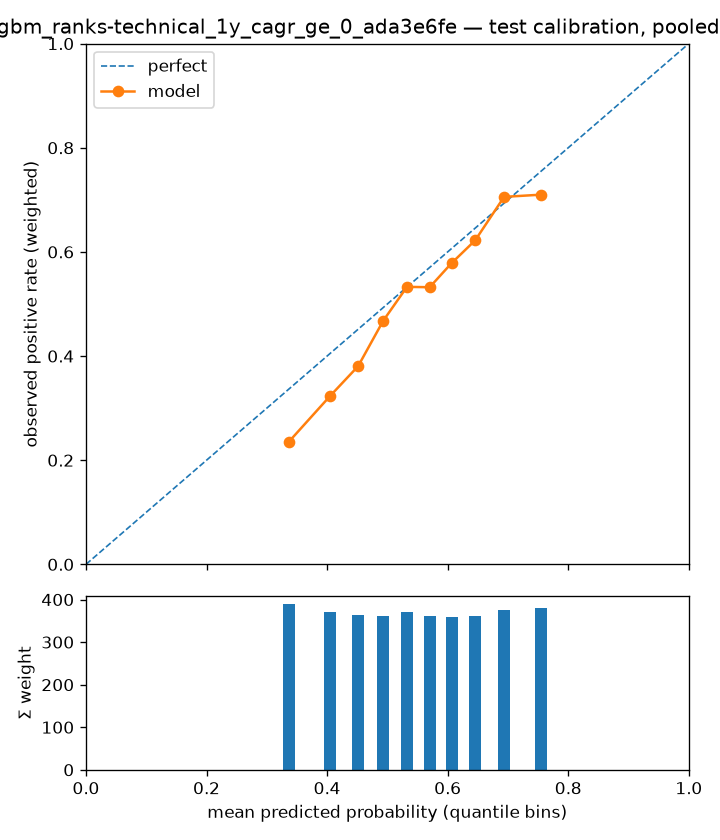

# Experiment report — lightgbm_ranks-technical_1y_cagr_ge_0_ada3e6fe

- run id: `18c841c3dfa6`
- dataset version: `1.1` (pinned, immutable)
- config hash: `5f289d3b90449512`
- git SHA: `60768d70fa2a848eabc08bd73031084eb0d3e096`
- seed: 23
- model: `lightgbm` params `{"class_weight": 1.0, "learning_rate": 0.03, "min_child_samples": 500, "n_estimators": 800, "num_leaves": 3, "reg_lambda": 0}`
- label: `label_1y_cagr_ge_0` — horizon 1y, scheme `holdout`
- **configurations tried against this cell (dataset, scheme, horizon, label): 2** (from the append-only results store; failed runs count)

## Era-sliced metrics (one row per test year)

Sliced on the calendar year of each test row's `snapshot_date` (one walk-forward fold per year); crash eras are tagged inline. `conf_at_K` is the mean score of the top-K picks; `base_rate_brier` is the no-skill Brier the model must beat. \*The pooled row picks per year — per-fold model scores are not comparable, so a global top-K would just take the hottest-scoring fold's picks; it is context for the era rows, never a stand-alone result. ROC-AUC and recall@K are logged in the results store, not shown here.

| era     | n_test | base_rate | precision_at_35 | conf_at_35 | brier  | base_rate_brier | pr_auc |
| ------- | ------ | --------- | --------------- | ---------- | ------ | --------------- | ------ |
| 2023    | 16875  | 0.5291    | 0.7143          | 0.8179     | 0.2179 | 0.2492          | 0.7183 |
| 2024    | 15596  | 0.4580    | 0.7714          | 0.8322     | 0.2393 | 0.2482          | 0.5899 |
| 2025    | 10043  | 0.5500    | 0.6571          | 0.8157     | 0.2342 | 0.2475          | 0.6420 |
| pooled* | 42514  | 0.5080    | 0.7143          | 0.8219     | 0.2296 | 0.2499          | 0.6480 |

## High-confidence picks (pooled)

How many high-confidence calls the model made, how confident it was, and how precise they were — no pre-chosen score threshold needed. `top N/yr` rows pick per test year; `score >= p` rows (probabilistic models) count every name at or above that probability, pooled.

| selection    | n_picks | picks_per_year | mean_score | precision | hits  |
| ------------ | ------- | -------------- | ---------- | --------- | ----- |
| top 5/yr     | 15      | 5              | 0.8305     | 0.8667    | 13    |
| top 10/yr    | 30      | 10             | 0.8280     | 0.7667    | 23    |
| top 20/yr    | 60      | 20             | 0.8253     | 0.7500    | 45    |
| top 50/yr    | 150     | 50             | 0.8193     | 0.7067    | 106   |
| score >= 0.9 | 0       | 0              | —          | —         | 0     |
| score >= 0.8 | 308     | 102.7000       | 0.8136     | 0.6851    | 211   |
| score >= 0.7 | 5785    | 1928.3000      | 0.7413     | 0.7091    | 4102  |
| score >= 0.6 | 15594   | 5198           | 0.6820     | 0.6554    | 10220 |
| score >= 0.5 | 26906   | 8968.7000      | 0.6270     | 0.5992    | 16123 |

## Calibration

Reliability curve on pooled test predictions (each fold's model is refit on its own expanding window). Downstream ranking trusts these probabilities; single trees are expected to calibrate poorly (known Phase-1 limitation, PLAN §2).

## Baseline comparison

**No baseline runs recorded for this cell.** Run `scripts/run_baselines.py` first; a result without its baselines is not reportable.

## Appendix — provenance & accounting

The material every report must carry (honest-evaluation checklist), kept out of the reading path.

### Fold definition (cited from `split_folds.parquet`)

Frozen fold manifest for the folds evaluated above — boundaries and role counts as built upstream; this report is invalid if the folds are redefined.

| fold | test_start | test_end   | embargo_days | n_train | n_test | n_purged | n_embargoed |
| ---- | ---------- | ---------- | ------------ | ------- | ------ | -------- | ----------- |
| 2023 | 2023-01-01 | 9999-12-31 | 30           | 1295491 | 42514  | 54801    | 4268        |

### Effective sample size

Σ `sample_weight_{H}y` over the rows actually fitted — the honest sample size under overlapping label windows; raw row counts are shown only for reconciliation.

| fold | train_rows | effective_train_size | test_rows |
| ---- | ---------- | -------------------- | --------- |
| 2023 | 1295491    | 114224.4940          | 42514     |

Cross-check: `manifest.json["effective_rows"]` for 1y = 130495.8 (whole dataset; every per-fold effective size above must be ≤ this).

### Crash-era metrics (with intervals)

No sampled crash era (2000–02, 2008–09, 2020, 2022) falls in the evaluated test years; the defensive-performance claim is untested by this run.
