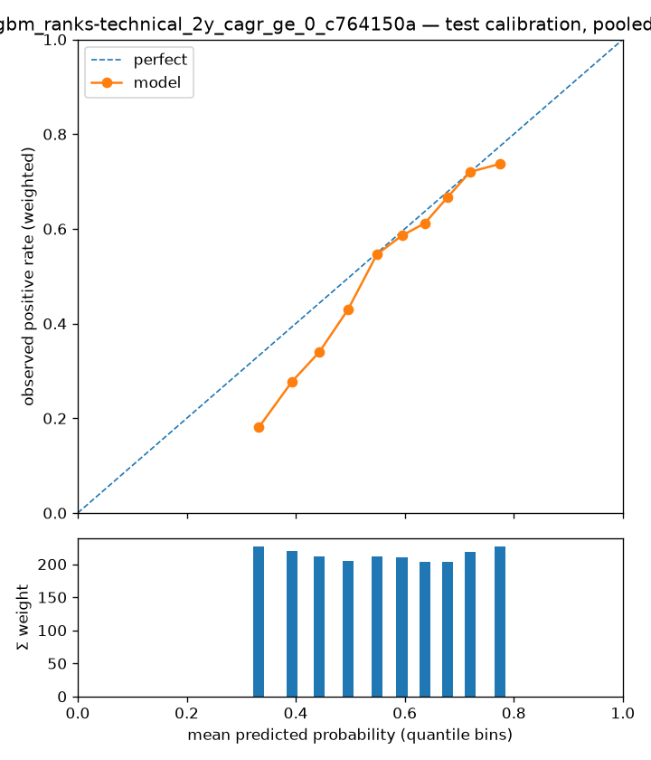

# Experiment report — lightgbm_ranks-technical_2y_cagr_ge_0_c764150a

- run id: `91dc3df48d8a`
- dataset version: `1.1` (pinned, immutable)
- config hash: `652aa15a9770ff60`
- git SHA: `60768d70fa2a848eabc08bd73031084eb0d3e096`
- seed: 23
- model: `lightgbm` params `{"class_weight": 1.0, "learning_rate": 0.03, "min_child_samples": 500, "n_estimators": 800, "num_leaves": 3, "reg_lambda": 0}`
- label: `label_2y_cagr_ge_0` — horizon 2y, scheme `holdout`
- **configurations tried against this cell (dataset, scheme, horizon, label): 2** (from the append-only results store; failed runs count)

## Era-sliced metrics (one row per test year)

Sliced on the calendar year of each test row's `snapshot_date` (one walk-forward fold per year); crash eras are tagged inline. `conf_at_K` is the mean score of the top-K picks; `base_rate_brier` is the no-skill Brier the model must beat. \*The pooled row picks per year — per-fold model scores are not comparable, so a global top-K would just take the hottest-scoring fold's picks; it is context for the era rows, never a stand-alone result. ROC-AUC and recall@K are logged in the results store, not shown here.

| era               | n_test | base_rate | precision_at_35 | conf_at_35 | brier  | base_rate_brier | pr_auc |
| ----------------- | ------ | --------- | --------------- | ---------- | ------ | --------------- | ------ |
| 2022 (rate-shock) | 18267  | 0.5158    | 0.6000          | 0.8764     | 0.2143 | 0.2497          | 0.7017 |
| 2023              | 16875  | 0.5020    | 0.7714          | 0.8526     | 0.2222 | 0.2500          | 0.6847 |
| 2024              | 10445  | 0.5028    | 0.5143          | 0.8467     | 0.2296 | 0.2500          | 0.6370 |
| pooled*           | 45587  | 0.5078    | 0.6286          | 0.8586     | 0.2207 | 0.2499          | 0.6774 |

## High-confidence picks (pooled)

How many high-confidence calls the model made, how confident it was, and how precise they were — no pre-chosen score threshold needed. `top N/yr` rows pick per test year; `score >= p` rows (probabilistic models) count every name at or above that probability, pooled.

| selection    | n_picks | picks_per_year | mean_score | precision | hits  |
| ------------ | ------- | -------------- | ---------- | --------- | ----- |
| top 5/yr     | 15      | 5              | 0.8761     | 0.8000    | 12    |
| top 10/yr    | 30      | 10             | 0.8705     | 0.6667    | 20    |
| top 20/yr    | 60      | 20             | 0.8643     | 0.6500    | 39    |
| top 50/yr    | 150     | 50             | 0.8540     | 0.6467    | 97    |
| score >= 0.9 | 0       | 0              | —          | —         | 0     |
| score >= 0.8 | 787     | 262.3000       | 0.8230     | 0.6595    | 519   |
| score >= 0.7 | 8998    | 2999.3000      | 0.7477     | 0.7090    | 6380  |
| score >= 0.6 | 20041   | 6680.3000      | 0.6938     | 0.6587    | 13202 |
| score >= 0.5 | 29275   | 9758.3000      | 0.6492     | 0.6121    | 17918 |

## Calibration

Reliability curve on pooled test predictions (each fold's model is refit on its own expanding window). Downstream ranking trusts these probabilities; single trees are expected to calibrate poorly (known Phase-1 limitation, PLAN §2).

## Baseline comparison

**No baseline runs recorded for this cell.** Run `scripts/run_baselines.py` first; a result without its baselines is not reportable.

## Appendix — provenance & accounting

The material every report must carry (honest-evaluation checklist), kept out of the reading path.

### Fold definition (cited from `split_folds.parquet`)

Frozen fold manifest for the folds evaluated above — boundaries and role counts as built upstream; this report is invalid if the folds are redefined.

| fold | test_start | test_end   | embargo_days | n_train | n_test | n_purged | n_embargoed |
| ---- | ---------- | ---------- | ------------ | ------- | ------ | -------- | ----------- |
| 2022 | 2022-01-01 | 9999-12-31 | 30           | 1199285 | 45587  | 97074    | 3400        |

### Effective sample size

Σ `sample_weight_{H}y` over the rows actually fitted — the honest sample size under overlapping label windows; raw row counts are shown only for reconciliation.

| fold | train_rows | effective_train_size | test_rows |
| ---- | ---------- | -------------------- | --------- |
| 2022 | 1199285    | 57554.4235           | 45587     |

Cross-check: `manifest.json["effective_rows"]` for 2y = 68841.8 (whole dataset; every per-fold effective size above must be ≤ this).

### Crash-era metrics (with intervals)

Drawdown eras broken out with uncertainty — the same years are tagged in the era table above. Intervals are Wilson 95% on precision@K treating the K picks as independent; they are not — same-year picks share sectors, factor bets and overlapping windows, so true uncertainty is wider than shown.

| era             | n_test | effective_n | base_rate | pr_auc | roc_auc | brier  | base_rate_brier | precision_at_35 | conf_at_35 | recall_at_35 | precision_at_35_ci95 |
| --------------- | ------ | ----------- | --------- | ------ | ------- | ------ | --------------- | --------------- | ---------- | ------------ | -------------------- |
| rate-shock 2022 | 18267  | 871.6788    | 0.5158    | 0.7017 | 0.7351  | 0.2143 | 0.2497          | 0.6000          | 0.8764     | 0.0023       | [0.44, 0.74]         |
