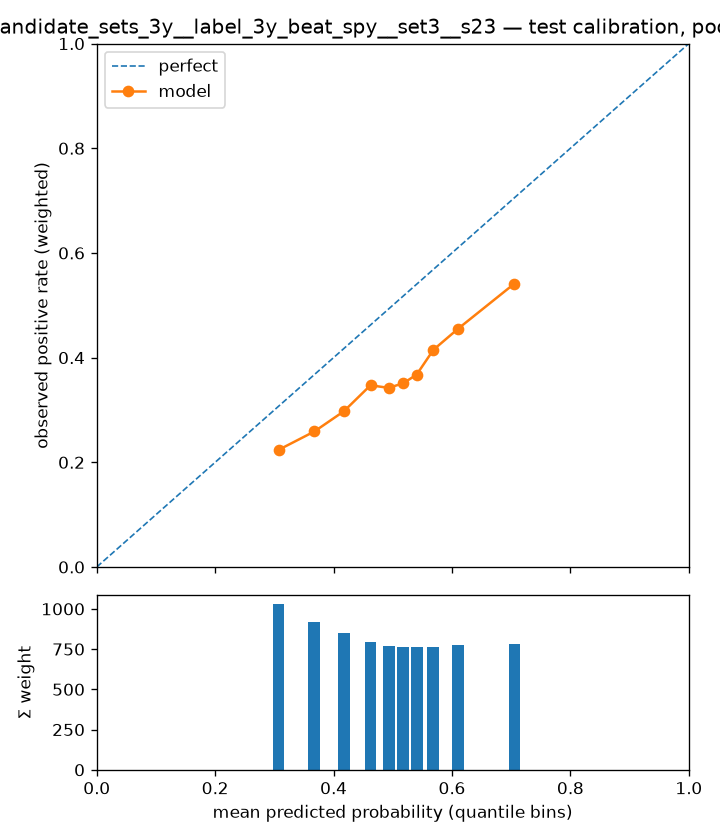

# Experiment report — forest_candidate_sets_3y__label_3y_beat_spy__set3__s23

- run id: `48129483682c`
- dataset version: `1.4` (pinned, immutable)
- config hash: `616ac1790f2ff7ac`
- git SHA: `b649c58e1d8c19bd5fe35da9f4cfec3cfed01da9`
- seed: 23
- model: `random_forest` params `{"bootstrap": true, "class_weight": 1.0, "criterion": "entropy", "max_depth": 3, "max_features": 0.504, "max_samples": 0.589, "min_samples_leaf": 38, "n_estimators": 407, "n_jobs": 8}`
- label: `label_3y_beat_spy` — horizon 3y, scheme `walkforward`
- **configurations tried against this cell (dataset, scheme, horizon, label): 14** (from the append-only results store; failed runs count)

## Era-sliced metrics (one row per test year)

Sliced on the calendar year of each test row's `snapshot_date` (one walk-forward fold per year); crash eras are tagged inline. `conf_at_K` is the mean score of the top-K picks; `base_rate_brier` is the no-skill Brier the model must beat. \*The pooled row picks per year — per-fold model scores are not comparable, so a global top-K would just take the hottest-scoring fold's picks; it is context for the era rows, never a stand-alone result. ROC-AUC and recall@K are logged in the results store, not shown here.

| era          | n_test | base_rate | precision_at_20 | precision_at_50 | conf_at_20 | conf_at_50 | n_at_prec_0.75 | n_at_prec_0.9 | recall_at_prec_0.75 | recall_at_prec_0.9 | brier  | base_rate_brier | pr_auc |
| ------------ | ------ | --------- | --------------- | --------------- | ---------- | ---------- | -------------- | ------------- | ------------------- | ------------------ | ------ | --------------- | ------ |
| 2005         | 18684  | 0.4084    | 0.7500          | 0.7000          | 0.8314     | 0.8301     | 22             | 0             | 0.0022              | 0                  | 0.2784 | 0.2416          | 0.4916 |
| 2006         | 18404  | 0.4634    | 0.6500          | 0.7200          | 0.7884     | 0.7864     | 105            | 2             | 0.0103              | 0.0003             | 0.2514 | 0.2487          | 0.5837 |
| 2007         | 18091  | 0.4642    | 0.6000          | 0.5400          | 0.7553     | 0.7515     | 2              | 2             | 0.0003              | 0.0003             | 0.2475 | 0.2487          | 0.5729 |
| 2008 (GFC)   | 17456  | 0.4630    | 0.7500          | 0.7400          | 0.7241     | 0.7196     | 49             | 3             | 0.0044              | 0.0004             | 0.2424 | 0.2486          | 0.5569 |
| 2009 (GFC)   | 16575  | 0.4353    | 0.6000          | 0.5800          | 0.7001     | 0.6964     | 2              | 2             | 0.0003              | 0.0003             | 0.2413 | 0.2458          | 0.5056 |
| 2010         | 16052  | 0.3606    | 0.4000          | 0.5000          | 0.6925     | 0.6889     | 4              | 0             | 0.0005              | 0                  | 0.2399 | 0.2306          | 0.4229 |
| 2011         | 15517  | 0.3236    | 0.5500          | 0.6000          | 0.6804     | 0.6756     | 0              | 0             | 0                   | 0                  | 0.2432 | 0.2189          | 0.3638 |
| 2012         | 15168  | 0.3397    | 0.4000          | 0.3600          | 0.6712     | 0.6654     | 3              | 3             | 0.0006              | 0.0006             | 0.2427 | 0.2243          | 0.3891 |
| 2013         | 15055  | 0.3179    | 0.2500          | 0.3000          | 0.6653     | 0.6617     | 1              | 1             | 0.0002              | 0.0002             | 0.2393 | 0.2168          | 0.3947 |
| 2014         | 15378  | 0.3011    | 0.1000          | 0.1000          | 0.6627     | 0.6599     | 0              | 0             | 0                   | 0                  | 0.2323 | 0.2104          | 0.3725 |
| 2015         | 15511  | 0.2965    | 0.2500          | 0.2800          | 0.6611     | 0.6586     | 0              | 0             | 0                   | 0                  | 0.2343 | 0.2086          | 0.3355 |
| 2016         | 15094  | 0.3106    | 0.4500          | 0.4200          | 0.6560     | 0.6533     | 1              | 1             | 0.0002              | 0.0002             | 0.2367 | 0.2141          | 0.3342 |
| 2017         | 14846  | 0.2364    | 0.1500          | 0.1600          | 0.6511     | 0.6474     | 0              | 0             | 0                   | 0                  | 0.2291 | 0.1805          | 0.2374 |
| 2018         | 14833  | 0.2575    | 0.1000          | 0.2000          | 0.6472     | 0.6448     | 0              | 0             | 0                   | 0                  | 0.2336 | 0.1912          | 0.2421 |
| 2019         | 14743  | 0.2655    | 0.2000          | 0.2400          | 0.6450     | 0.6419     | 0              | 0             | 0                   | 0                  | 0.2217 | 0.1950          | 0.2761 |
| 2020 (COVID) | 14944  | 0.3273    | 0.6000          | 0.3400          | 0.6431     | 0.6352     | 11             | 0             | 0.0017              | 0                  | 0.2112 | 0.2202          | 0.4176 |
| pooled*      | 256351 | 0.3535    | 0.4250          | 0.4238          | 0.6922     | 0.6885     | 200            | 14            | 0.0017              | 0.0002             | 0.2399 | 0.2285          | 0.4528 |

## High-confidence picks (pooled)

How many high-confidence calls the model made, how confident it was, and how precise they were — no pre-chosen score threshold needed. `top N/yr` rows pick per test year; `score >= p` rows (probabilistic models) count every name at or above that probability, pooled.

| selection    | n_picks | picks_per_year | mean_score | precision | hits  |
| ------------ | ------- | -------------- | ---------- | --------- | ----- |
| top 5/yr     | 80      | 5              | 0.6943     | 0.4625    | 37    |
| top 10/yr    | 160     | 10             | 0.6935     | 0.4062    | 65    |
| top 20/yr    | 320     | 20             | 0.6922     | 0.4250    | 136   |
| top 50/yr    | 800     | 50             | 0.6885     | 0.4238    | 339   |
| score >= 0.9 | 0       | 0              | —          | —         | 0     |
| score >= 0.8 | 1209    | 75.6000        | 0.8146     | 0.5368    | 649   |
| score >= 0.7 | 12263   | 766.4000       | 0.7475     | 0.5526    | 6776  |
| score >= 0.6 | 43337   | 2708.6000      | 0.6699     | 0.4975    | 21561 |
| score >= 0.5 | 134197  | 8387.3000      | 0.5847     | 0.4233    | 56799 |

## Calibration

Reliability curve on pooled test predictions (each fold's model is refit on its own expanding window). Downstream ranking trusts these probabilities; single trees are expected to calibrate poorly (known Phase-1 limitation, PLAN §2).

## Baseline comparison

Latest completed baseline runs against this same cell (dataset, scheme, horizon, label), metrics averaged across folds. A model that does not clear these is a negative result, reported as such.

| experiment                          | model          | folds | base_rate | base_rate_brier | brier  | n_test     | pr_auc | precision_at_20 | precision_at_50 |
| ----------------------------------- | -------------- | ----- | --------- | --------------- | ------ | ---------- | ------ | --------------- | --------------- |
| baseline_b2m_rank_label_3y_beat_spy | rank_factor    | 16    | 0.3482    | —               | —      | 16021.9375 | 0.3388 | 0.1938          | 0.2050          |
| baseline_ey_rank_label_3y_beat_spy  | rank_factor    | 16    | 0.3482    | —               | —      | 16021.9375 | 0.3846 | 0.2156          | 0.2363          |
| baseline_majority_label_3y_beat_spy | majority_class | 16    | 0.3482    | 0.2215          | 0.2364 | 16021.9375 | 0.3482 | 0.1969          | 0.1262          |
| baseline_random_label_3y_beat_spy   | random_ranking | 16    | 0.3482    | —               | —      | 16021.9375 | 0.3494 | 0.3906          | 0.3788          |

## Interpretability artifacts

- per-fold feature importances: [forest_candidate_sets_3y__label_3y_beat_spy__set3__s23_importances.csv](forest_candidate_sets_3y__label_3y_beat_spy__set3__s23_importances.csv) — impurity/gain-based, so a triage list for feature subsets (which count as configurations tried), not an explanation; the top of the ranking:

| feature                 | mean_importance |
| ----------------------- | --------------- |
| ocf_yield_rank          | 0.1965          |
| vol_12m                 | 0.1375          |
| beta_12m                | 0.1183          |
| cfo_to_assets_rank      | 0.0893          |
| ret_6m                  | 0.0607          |
| ffo_to_liabilities_rank | 0.0535          |
| ebitda_to_ev_rank       | 0.0531          |
| net_margin_rank         | 0.0311          |
| ret_1m                  | 0.0299          |
| price_vs_5y_avg         | 0.0246          |

## Appendix — provenance & accounting

The material every report must carry (honest-evaluation checklist), kept out of the reading path.

### Fold definition (cited from `split_folds.parquet`)

Frozen fold manifest for the folds evaluated above — boundaries and role counts as built upstream; this report is invalid if the folds are redefined.

| fold | test_start | test_end   | embargo_days | n_train | n_test | n_purged | n_embargoed |
| ---- | ---------- | ---------- | ------------ | ------- | ------ | -------- | ----------- |
| 2005 | 2005-01-01 | 2006-01-01 | 30           | 299982  | 18684  | 174048   | 4434        |
| 2006 | 2006-01-01 | 2007-01-01 | 30           | 361098  | 18404  | 169731   | 3687        |
| 2007 | 2007-01-01 | 2008-01-01 | 30           | 417875  | 18091  | 167697   | 4156        |
| 2008 | 2008-01-01 | 2009-01-01 | 30           | 474239  | 17456  | 165537   | 4225        |
| 2009 | 2009-01-01 | 2010-01-01 | 30           | 530702  | 16575  | 161853   | 3814        |
| 2010 | 2010-01-01 | 2011-01-01 | 30           | 585955  | 16052  | 156366   | 3773        |
| 2011 | 2011-01-01 | 2012-01-01 | 30           | 639990  | 15517  | 150249   | 4011        |
| 2012 | 2012-01-01 | 2013-01-01 | 30           | 693610  | 15168  | 144432   | 2759        |
| 2013 | 2013-01-01 | 2014-01-01 | 30           | 742572  | 15055  | 140211   | 3522        |
| 2014 | 2014-01-01 | 2015-01-01 | 30           | 790688  | 15378  | 137220   | 3562        |
| 2015 | 2015-01-01 | 2016-01-01 | 30           | 837864  | 15511  | 136803   | 2937        |
| 2016 | 2016-01-01 | 2017-01-01 | 30           | 883177  | 15094  | 137832   | 3128        |
| 2017 | 2017-01-01 | 2018-01-01 | 30           | 928008  | 14846  | 137949   | 3462        |
| 2018 | 2018-01-01 | 2019-01-01 | 30           | 973897  | 14833  | 136353   | 3707        |
| 2019 | 2019-01-01 | 2020-01-01 | 30           | 1020662 | 14743  | 134319   | 3475        |
| 2020 | 2020-01-01 | 2021-01-01 | 30           | 1066158 | 14944  | 133266   | 3261        |

### Effective sample size

Σ `sample_weight_{H}y` over the rows actually fitted — the honest sample size under overlapping label windows; raw row counts are shown only for reconciliation.

| fold | train_rows | effective_train_size | test_rows |
| ---- | ---------- | -------------------- | --------- |
| 2005 | 299982     | 12690.9998           | 18684     |
| 2006 | 361098     | 14627.4294           | 18404     |
| 2007 | 417875     | 16397.6923           | 18091     |
| 2008 | 474239     | 18195.5038           | 17456     |
| 2009 | 530702     | 20014.2244           | 16575     |
| 2010 | 585955     | 21805.5178           | 16052     |
| 2011 | 639990     | 23582.5204           | 15517     |
| 2012 | 693610     | 25294.6522           | 15168     |
| 2013 | 742572     | 26821.9914           | 15055     |
| 2014 | 790688     | 28347.4439           | 15378     |
| 2015 | 837864     | 29839.0997           | 15511     |
| 2016 | 883177     | 31271.0955           | 15094     |
| 2017 | 928008     | 32701.4481           | 14846     |
| 2018 | 973897     | 34195.1179           | 14833     |
| 2019 | 1020662    | 35731.1885           | 14743     |
| 2020 | 1066158    | 37197.5720           | 14944     |

Cross-check: `manifest.json["effective_rows"]` for 3y = 47994.0 (whole dataset; every per-fold effective size above must be ≤ this).

### Crash-era metrics (with intervals)

Drawdown eras broken out with uncertainty — the same years are tagged in the era table above. Intervals are Wilson 95% on precision@K treating the K picks as independent; they are not — same-year picks share sectors, factor bets and overlapping windows, so true uncertainty is wider than shown.

| era         | n_test | effective_n | base_rate | pr_auc | roc_auc | brier  | base_rate_brier | precision_at_20 | conf_at_20 | recall_at_20 | precision_at_50 | conf_at_50 | recall_at_50 | recall_at_prec_0.75 | n_at_prec_0.75 | recall_at_prec_0.9 | n_at_prec_0.9 | precision_at_20_ci95 | precision_at_50_ci95 |
| ----------- | ------ | ----------- | --------- | ------ | ------- | ------ | --------------- | --------------- | ---------- | ------------ | --------------- | ---------- | ------------ | ------------------- | -------------- | ------------------ | ------------- | -------------------- | -------------------- |
| GFC 2008-09 | 34031  | 1068.7700   | 0.4497    | 0.5366 | 0.6066  | 0.2419 | 0.2475          | 0.6750          | 0.7121     | 0.0017       | 0.6600          | 0.7080     | 0.0041       | 0.0025              | 51             | 0.0003             | 5             | [0.52, 0.80]         | [0.56, 0.75]         |
| COVID 2020  | 14944  | 487.9190    | 0.3273    | 0.4176 | 0.6676  | 0.2112 | 0.2202          | 0.6000          | 0.6431     | 0.0023       | 0.3400          | 0.6352     | 0.0032       | 0.0017              | 11             | 0                  | 0             | [0.39, 0.78]         | [0.22, 0.48]         |
