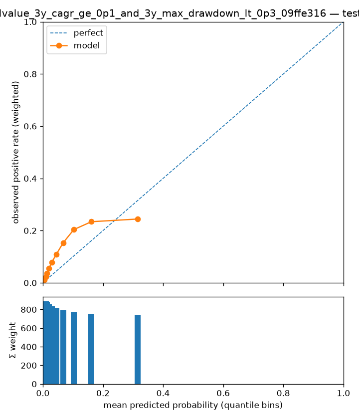

# Experiment report — lightgbm_ranks-ranks-relvalue_3y_cagr_ge_0p1_and_3y_max_drawdown_lt_0p3_09ffe316

- run id: `d397b818a6d1`
- dataset version: `1.4` (pinned, immutable)
- config hash: `0d86cd96370c4184`
- git SHA: `7a2fb0dab776f24c53bf7901d2ffc5999655ecb0`
- seed: 7
- model: `lightgbm` params `{"class_weight": 0.5, "colsample_bytree": 0.8, "learning_rate": 0.05, "min_child_samples": 60, "n_estimators": 300, "num_leaves": 15, "reg_lambda": 1.0, "subsample": 0.8, "subsample_freq": 1}`
- label: `fwd_3y_cagr >= 0.1 & fwd_3y_max_drawdown < 0.3` — horizon 3y, scheme `walkforward`
- derived label `fwd_3y_cagr >= 0.1 & fwd_3y_max_drawdown < 0.3`: evaluated on the fly from the manifest's continuous outcome columns (harness.derived_labels); NULL wherever a referenced column is NULL
- **configurations tried against this cell (dataset, scheme, horizon, label): 1** (from the append-only results store; failed runs count)
- saved model bundle: `experiments/models/lightgbm_ranks-ranks-relvalue_3y_cagr_ge_0p1_and_3y_max_drawdown_lt_0p3_09ffe316_d397b818a6d1` (re-evaluate with `vml-eval`, no refitting)

## Era-sliced metrics (one row per test year)

Sliced on the calendar year of each test row's `snapshot_date` (one walk-forward fold per year); crash eras are tagged inline. `conf_at_K` is the mean score of the top-K picks; `base_rate_brier` is the no-skill Brier the model must beat. \*The pooled row picks per year — per-fold model scores are not comparable, so a global top-K would just take the hottest-scoring fold's picks; it is context for the era rows, never a stand-alone result. ROC-AUC and recall@K are logged in the results store, not shown here.

| era          | n_test | base_rate | precision_at_20 | precision_at_50 | conf_at_20 | conf_at_50 | n_at_prec_0.75 | n_at_prec_0.9 | recall_at_prec_0.75 | recall_at_prec_0.9 | brier  | base_rate_brier | pr_auc |
| ------------ | ------ | --------- | --------------- | --------------- | ---------- | ---------- | -------------- | ------------- | ------------------- | ------------------ | ------ | --------------- | ------ |
| 2005         | 18684  | 0.0986    | 0.0500          | 0.0400          | 0.7536     | 0.6972     | 0              | 0             | 0                   | 0                  | 0.0933 | 0.0889          | 0.1678 |
| 2006         | 18404  | 0.0514    | 0               | 0.0400          | 0.7848     | 0.7406     | 0              | 0             | 0                   | 0                  | 0.0583 | 0.0487          | 0.0632 |
| 2007         | 18091  | 0.0224    | 0               | 0               | 0.7361     | 0.7055     | 0              | 0             | 0                   | 0                  | 0.0400 | 0.0219          | 0.0288 |
| 2008 (GFC)   | 17456  | 0.0315    | 0               | 0.0200          | 0.6788     | 0.6407     | 0              | 0             | 0                   | 0                  | 0.0432 | 0.0305          | 0.0761 |
| 2009 (GFC)   | 16575  | 0.1566    | 0.6000          | 0.6400          | 0.6252     | 0.5826     | 7              | 7             | 0.0027              | 0.0027             | 0.1158 | 0.1321          | 0.4370 |
| 2010         | 16052  | 0.1673    | 0.5500          | 0.6200          | 0.6119     | 0.5765     | 0              | 0             | 0                   | 0                  | 0.1238 | 0.1393          | 0.4530 |
| 2011         | 15517  | 0.2126    | 0.8500          | 0.7800          | 0.5375     | 0.4882     | 72             | 16            | 0.0157              | 0.0044             | 0.1671 | 0.1674          | 0.5110 |
| 2012         | 15168  | 0.2529    | 0.4500          | 0.4800          | 0.4024     | 0.3533     | 0              | 0             | 0                   | 0                  | 0.2146 | 0.1889          | 0.5137 |
| 2013         | 15055  | 0.1535    | 0.3500          | 0.4400          | 0.4896     | 0.4248     | 4              | 1             | 0.0013              | 0.0004             | 0.1285 | 0.1300          | 0.3626 |
| 2014         | 15378  | 0.1408    | 0.8500          | 0.6800          | 0.5397     | 0.4944     | 26             | 12            | 0.0092              | 0.0048             | 0.1148 | 0.1210          | 0.3789 |
| 2015         | 15511  | 0.1451    | 0.5500          | 0.5000          | 0.5100     | 0.4619     | 0              | 0             | 0                   | 0                  | 0.1177 | 0.1240          | 0.3619 |
| 2016         | 15094  | 0.1660    | 0.6000          | 0.5800          | 0.6063     | 0.5661     | 9              | 0             | 0.0027              | 0                  | 0.1307 | 0.1385          | 0.3724 |
| 2017         | 14846  | 0.0610    | 0.4500          | 0.2400          | 0.6359     | 0.5956     | 8              | 4             | 0.0068              | 0.0045             | 0.0596 | 0.0572          | 0.1356 |
| 2018         | 14833  | 0.0312    | 0.3500          | 0.1800          | 0.6124     | 0.5801     | 4              | 4             | 0.0091              | 0.0091             | 0.0390 | 0.0302          | 0.0665 |
| 2019         | 14743  | 0.0242    | 0               | 0.0400          | 0.5668     | 0.5173     | 0              | 0             | 0                   | 0                  | 0.0319 | 0.0236          | 0.0429 |
| 2020 (COVID) | 14944  | 0.0759    | 0.1500          | 0.1000          | 0.5663     | 0.5306     | 0              | 0             | 0                   | 0                  | 0.0685 | 0.0702          | 0.1610 |
| pooled*      | 256351 | 0.1097    | 0.3625          | 0.3362          | 0.6036     | 0.5597     | 130            | 44            | 0.0036              | 0.0015             | 0.0952 | 0.0976          | 0.2152 |

## High-confidence picks (pooled)

How many high-confidence calls the model made, how confident it was, and how precise they were — no pre-chosen score threshold needed. `top N/yr` rows pick per test year; `score >= p` rows (probabilistic models) count every name at or above that probability, pooled.

| selection    | n_picks | picks_per_year | mean_score | precision | hits |
| ------------ | ------- | -------------- | ---------- | --------- | ---- |
| top 5/yr     | 80      | 5              | 0.6498     | 0.4625    | 37   |
| top 10/yr    | 160     | 10             | 0.6299     | 0.4125    | 66   |
| top 20/yr    | 320     | 20             | 0.6036     | 0.3625    | 116  |
| top 50/yr    | 800     | 50             | 0.5597     | 0.3362    | 269  |
| score >= 0.9 | 0       | 0              | —          | —         | 0    |
| score >= 0.8 | 10      | 0.6000         | 0.8263     | 0         | 0    |
| score >= 0.7 | 97      | 6.1000         | 0.7420     | 0.0206    | 2    |
| score >= 0.6 | 434     | 27.1000        | 0.6626     | 0.1106    | 48   |
| score >= 0.5 | 1542    | 96.4000        | 0.5762     | 0.1965    | 303  |

## Calibration

Reliability curve on pooled test predictions (each fold's model is refit on its own expanding window). Downstream ranking trusts these probabilities; single trees are expected to calibrate poorly (known Phase-1 limitation, PLAN §2).

## Baseline comparison

**No baseline runs recorded for this cell.** Run `scripts/run_baselines.py` first; a result without its baselines is not reportable.

## Interpretability artifacts

- per-fold feature importances: [lightgbm_ranks-ranks-relvalue_3y_cagr_ge_0p1_and_3y_max_drawdown_lt_0p3_09ffe316_importances.csv](lightgbm_ranks-ranks-relvalue_3y_cagr_ge_0p1_and_3y_max_drawdown_lt_0p3_09ffe316_importances.csv) — impurity/gain-based, so a triage list for feature subsets (which count as configurations tried), not an explanation; the top of the ranking:

| feature                | mean_importance |
| ---------------------- | --------------- |
| vol_12m_rank           | 0.3686          |
| vol_36m_rank           | 0.1100          |
| dist_52w_high_rank     | 0.0352          |
| max_ret_21d_rank       | 0.0323          |
| log_assets_rank        | 0.0260          |
| price_vs_5y_avg_rank   | 0.0245          |
| dist_5y_high_rank      | 0.0185          |
| dividend_yield_rank    | 0.0175          |
| retearn_to_assets_rank | 0.0158          |
| ocf_yield_rank         | 0.0137          |

## Appendix — provenance & accounting

The material every report must carry (honest-evaluation checklist), kept out of the reading path.

### Fold definition (cited from `split_folds.parquet`)

Frozen fold manifest for the folds evaluated above — boundaries and role counts as built upstream; this report is invalid if the folds are redefined.

| fold | test_start | test_end   | embargo_days | n_train | n_test | n_purged | n_embargoed |
| ---- | ---------- | ---------- | ------------ | ------- | ------ | -------- | ----------- |
| 2005 | 2005-01-01 | 2006-01-01 | 30           | 299982  | 18684  | 174048   | 4434        |
| 2006 | 2006-01-01 | 2007-01-01 | 30           | 361098  | 18404  | 169731   | 3687        |
| 2007 | 2007-01-01 | 2008-01-01 | 30           | 417875  | 18091  | 167697   | 4156        |
| 2008 | 2008-01-01 | 2009-01-01 | 30           | 474239  | 17456  | 165537   | 4225        |
| 2009 | 2009-01-01 | 2010-01-01 | 30           | 530702  | 16575  | 161853   | 3814        |
| 2010 | 2010-01-01 | 2011-01-01 | 30           | 585955  | 16052  | 156366   | 3773        |
| 2011 | 2011-01-01 | 2012-01-01 | 30           | 639990  | 15517  | 150249   | 4011        |
| 2012 | 2012-01-01 | 2013-01-01 | 30           | 693610  | 15168  | 144432   | 2759        |
| 2013 | 2013-01-01 | 2014-01-01 | 30           | 742572  | 15055  | 140211   | 3522        |
| 2014 | 2014-01-01 | 2015-01-01 | 30           | 790688  | 15378  | 137220   | 3562        |
| 2015 | 2015-01-01 | 2016-01-01 | 30           | 837864  | 15511  | 136803   | 2937        |
| 2016 | 2016-01-01 | 2017-01-01 | 30           | 883177  | 15094  | 137832   | 3128        |
| 2017 | 2017-01-01 | 2018-01-01 | 30           | 928008  | 14846  | 137949   | 3462        |
| 2018 | 2018-01-01 | 2019-01-01 | 30           | 973897  | 14833  | 136353   | 3707        |
| 2019 | 2019-01-01 | 2020-01-01 | 30           | 1020662 | 14743  | 134319   | 3475        |
| 2020 | 2020-01-01 | 2021-01-01 | 30           | 1066158 | 14944  | 133266   | 3261        |

### Effective sample size

Σ `sample_weight_{H}y` over the rows actually fitted — the honest sample size under overlapping label windows; raw row counts are shown only for reconciliation.

| fold | train_rows | effective_train_size | test_rows |
| ---- | ---------- | -------------------- | --------- |
| 2005 | 299982     | 12690.9998           | 18684     |
| 2006 | 361098     | 14627.4294           | 18404     |
| 2007 | 417875     | 16397.6923           | 18091     |
| 2008 | 474239     | 18195.5038           | 17456     |
| 2009 | 530702     | 20014.2244           | 16575     |
| 2010 | 585955     | 21805.5178           | 16052     |
| 2011 | 639990     | 23582.5204           | 15517     |
| 2012 | 693610     | 25294.6522           | 15168     |
| 2013 | 742572     | 26821.9914           | 15055     |
| 2014 | 790688     | 28347.4439           | 15378     |
| 2015 | 837864     | 29839.0997           | 15511     |
| 2016 | 883177     | 31271.0955           | 15094     |
| 2017 | 928008     | 32701.4481           | 14846     |
| 2018 | 973897     | 34195.1179           | 14833     |
| 2019 | 1020662    | 35731.1885           | 14743     |
| 2020 | 1066158    | 37197.5720           | 14944     |

Cross-check: `manifest.json["effective_rows"]` for 3y = 47994.0 (whole dataset; every per-fold effective size above must be ≤ this).

### Crash-era metrics (with intervals)

Drawdown eras broken out with uncertainty — the same years are tagged in the era table above. Intervals are Wilson 95% on precision@K treating the K picks as independent; they are not — same-year picks share sectors, factor bets and overlapping windows, so true uncertainty is wider than shown.

| era         | n_test | effective_n | base_rate | pr_auc | roc_auc | brier  | base_rate_brier | precision_at_20 | conf_at_20 | recall_at_20 | precision_at_50 | conf_at_50 | recall_at_50 | recall_at_prec_0.75 | n_at_prec_0.75 | recall_at_prec_0.9 | n_at_prec_0.9 | precision_at_20_ci95 | precision_at_50_ci95 |
| ----------- | ------ | ----------- | --------- | ------ | ------- | ------ | --------------- | --------------- | ---------- | ------------ | --------------- | ---------- | ------------ | ------------------- | -------------- | ------------------ | ------------- | -------------------- | -------------------- |
| GFC 2008-09 | 34031  | 1068.7700   | 0.0917    | 0.2224 | 0.7773  | 0.0782 | 0.0833          | 0.3000          | 0.6520     | 0.0039       | 0.3300          | 0.6116     | 0.0107       | 0.0023              | 7              | 0.0023             | 7             | [0.18, 0.45]         | [0.25, 0.43]         |
| COVID 2020  | 14944  | 487.9190    | 0.0759    | 0.1610 | 0.7479  | 0.0685 | 0.0702          | 0.1500          | 0.5663     | 0.0027       | 0.1000          | 0.5306     | 0.0044       | 0                   | 0              | 0                  | 0             | [0.05, 0.36]         | [0.04, 0.21]         |
