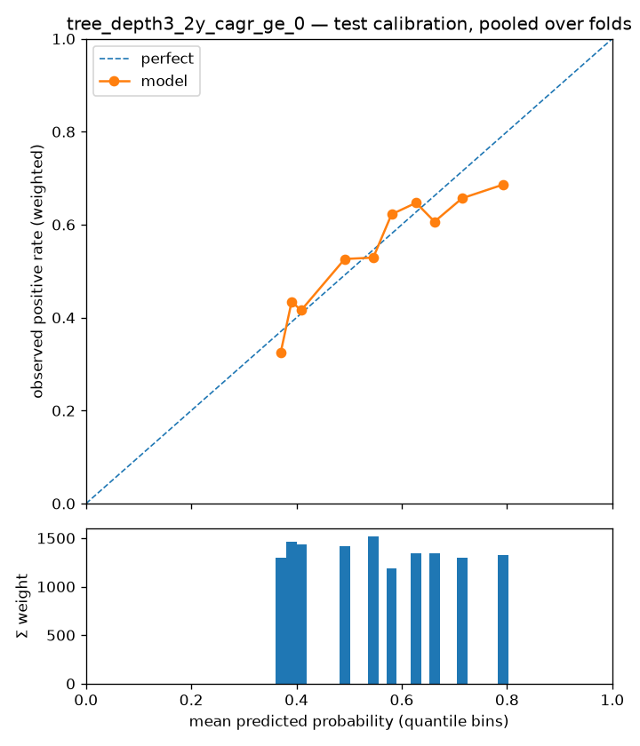

# Experiment report — tree_depth3_2y_cagr_ge_0

- run id: `078055771e36`
- dataset version: `1.0` (pinned, immutable)
- config hash: `7f129ded6dda6fab`
- git SHA: `bbe8af7a060ad8b80f16625731a4aa6df8d841c0`
- seed: 7
- model: `decision_tree` params `{"max_depth": 3}`
- label: `label_2y_cagr_ge_0` — horizon 2y, scheme `walkforward`
- **configurations tried against this cell (dataset, scheme, horizon, label): 5** (from the append-only results store; failed runs count)

## Fold definition (cited from `split_folds.parquet`)

Frozen fold manifest for the folds evaluated below — boundaries and role counts as built upstream; this report is invalid if the folds are redefined.

| fold | test_start | test_end | embargo_days | n_train | n_test | n_purged | n_embargoed |
| --- | --- | --- | --- | --- | --- | --- | --- |
| 2004 | 2004-01-01 | 2005-01-01 | 30 | 300002 | 19032 | 118278 | 4438 |
| 2005 | 2005-01-01 | 2006-01-01 | 30 | 361317 | 18908 | 114795 | 3702 |
| 2006 | 2006-01-01 | 2007-01-01 | 30 | 418535 | 18618 | 113820 | 4183 |
| 2007 | 2007-01-01 | 2008-01-01 | 30 | 475553 | 18297 | 112578 | 4261 |
| 2008 | 2008-01-01 | 2009-01-01 | 30 | 532688 | 17716 | 110745 | 3850 |
| 2009 | 2009-01-01 | 2010-01-01 | 30 | 588590 | 16875 | 108039 | 3802 |
| 2010 | 2010-01-01 | 2011-01-01 | 30 | 643233 | 16379 | 103773 | 4050 |
| 2011 | 2011-01-01 | 2012-01-01 | 30 | 697637 | 15849 | 99762 | 2794 |
| 2012 | 2012-01-01 | 2013-01-01 | 30 | 747480 | 15474 | 96684 | 3576 |
| 2013 | 2013-01-01 | 2014-01-01 | 30 | 796587 | 15340 | 93969 | 3606 |
| 2014 | 2014-01-01 | 2015-01-01 | 30 | 844755 | 15654 | 92442 | 2985 |
| 2015 | 2015-01-01 | 2016-01-01 | 30 | 890989 | 15797 | 92982 | 3173 |
| 2016 | 2016-01-01 | 2017-01-01 | 30 | 936680 | 15324 | 94353 | 3502 |
| 2017 | 2017-01-01 | 2018-01-01 | 30 | 983393 | 15069 | 93363 | 3751 |
| 2018 | 2018-01-01 | 2019-01-01 | 30 | 1031007 | 15040 | 91179 | 3528 |
| 2019 | 2019-01-01 | 2020-01-01 | 30 | 1077214 | 14951 | 90327 | 3293 |
| 2020 | 2020-01-01 | 2021-01-01 | 30 | 1122622 | 15193 | 89973 | 3092 |
| 2021 | 2021-01-01 | 2022-01-01 | 30 | 1166848 | 17659 | 90432 | 3986 |

## Effective sample size

Σ `sample_weight_{H}y` over the rows actually fitted — the honest sample size under overlapping label windows; raw row counts are shown only for reconciliation.

| fold | train_rows | effective_train_size | test_rows |
| --- | --- | --- | --- |
| 2004 | 300002 | 16462.6445 | 19032 |
| 2005 | 361317 | 19233.8600 | 18908 |
| 2006 | 418535 | 21797.1302 | 18618 |
| 2007 | 475553 | 24399.1990 | 18297 |
| 2008 | 532688 | 27014.3193 | 17716 |
| 2009 | 588590 | 29584.0200 | 16875 |
| 2010 | 643233 | 32123.2604 | 16379 |
| 2011 | 697637 | 34588.7899 | 15849 |
| 2012 | 747480 | 36815.4991 | 15474 |
| 2013 | 796587 | 39046.0989 | 15340 |
| 2014 | 844755 | 41224.1967 | 15654 |
| 2015 | 890989 | 43317.5899 | 15797 |
| 2016 | 936680 | 45401.0507 | 15324 |
| 2017 | 983393 | 47557.1211 | 15069 |
| 2018 | 1031007 | 49770.1094 | 15040 |
| 2019 | 1077214 | 51883.9572 | 14951 |
| 2020 | 1122622 | 53966.6778 | 15193 |
| 2021 | 1166848 | 56006.7317 | 17659 |

Cross-check: `manifest.json["effective_rows"]` for 2y = 69247.5 (whole dataset; every per-fold effective size above must be ≤ this).

## Metrics per fold (era-sliced)

One row per walk-forward fold = one test year; pooled numbers are never presented alone. Brier is reported only for probabilistic scores; ROC-AUC is logged, never headline.

| fold | n_test | base_rate | pr_auc | roc_auc | brier | precision_at_20 | recall_at_20 | precision_at_50 | recall_at_50 |
| --- | --- | --- | --- | --- | --- | --- | --- | --- | --- |
| 2004 | 19032 | 0.6225 | 0.7450 | 0.6708 | 0.2362 | 0.8000 | 0.0014 | 0.7800 | 0.0033 |
| 2005 | 18908 | 0.6482 | 0.7495 | 0.6397 | 0.2279 | 0.9000 | 0.0015 | 0.9400 | 0.0039 |
| 2006 | 18618 | 0.4281 | 0.5037 | 0.6013 | 0.2737 | 0.6500 | 0.0017 | 0.6600 | 0.0043 |
| 2007 | 18297 | 0.2235 | 0.2674 | 0.5723 | 0.3225 | 0.7500 | 0.0043 | 0.8200 | 0.0118 |
| 2008 | 17716 | 0.4795 | 0.5365 | 0.5781 | 0.2661 | 0.4500 | 0.0011 | 0.5600 | 0.0033 |
| 2009 | 16875 | 0.7203 | 0.8140 | 0.6733 | 0.2029 | 0.8000 | 0.0013 | 0.8600 | 0.0035 |
| 2010 | 16379 | 0.5993 | 0.7412 | 0.6910 | 0.2201 | 0.9000 | 0.0018 | 0.8800 | 0.0045 |
| 2011 | 15849 | 0.6242 | 0.7631 | 0.7009 | 0.2205 | 0.8500 | 0.0017 | 0.8200 | 0.0041 |
| 2012 | 15474 | 0.7299 | 0.8400 | 0.7030 | 0.2131 | 0.8500 | 0.0015 | 0.9200 | 0.0041 |
| 2013 | 15340 | 0.6068 | 0.7095 | 0.6502 | 0.2270 | 0.5500 | 0.0012 | 0.7200 | 0.0039 |
| 2014 | 15654 | 0.4449 | 0.5679 | 0.6514 | 0.2387 | 0.6000 | 0.0017 | 0.6000 | 0.0043 |
| 2015 | 15797 | 0.5372 | 0.6783 | 0.6827 | 0.2228 | 0.9000 | 0.0021 | 0.8600 | 0.0051 |
| 2016 | 15324 | 0.6517 | 0.7452 | 0.6579 | 0.2189 | 0.8000 | 0.0016 | 0.7800 | 0.0039 |
| 2017 | 15069 | 0.5174 | 0.6549 | 0.6632 | 0.2292 | 0.7000 | 0.0018 | 0.7600 | 0.0049 |
| 2018 | 15040 | 0.4217 | 0.5077 | 0.6006 | 0.2544 | 0.4000 | 0.0013 | 0.5600 | 0.0045 |
| 2019 | 14951 | 0.6559 | 0.7240 | 0.6122 | 0.2288 | 0.7500 | 0.0015 | 0.7600 | 0.0039 |
| 2020 | 15193 | 0.5591 | 0.6658 | 0.6447 | 0.2279 | 0.4000 | 0.0009 | 0.6000 | 0.0034 |
| 2021 | 17659 | 0.3781 | 0.4843 | 0.6583 | 0.2431 | 0.5500 | 0.0017 | 0.5400 | 0.0042 |

## Era-sliced metrics (per test year)

Sliced on the calendar year of each test row's `snapshot_date`. The pooled row is context for the era rows, never a stand-alone result.

| era | n_test | effective_n | base_rate | pr_auc | roc_auc | brier | precision_at_20 | recall_at_20 | precision_at_50 | recall_at_50 |
| --- | --- | --- | --- | --- | --- | --- | --- | --- | --- | --- |
| 2004 | 19032 | 865.9566 | 0.6225 | 0.7450 | 0.6708 | 0.2362 | 0.8000 | 0.0014 | 0.7800 | 0.0033 |
| 2005 | 18908 | 863.1555 | 0.6482 | 0.7495 | 0.6397 | 0.2279 | 0.9000 | 0.0015 | 0.9400 | 0.0039 |
| 2006 | 18618 | 853.4717 | 0.4281 | 0.5037 | 0.6013 | 0.2737 | 0.6500 | 0.0017 | 0.6600 | 0.0043 |
| 2007 | 18297 | 845.8977 | 0.2235 | 0.2674 | 0.5723 | 0.3225 | 0.7500 | 0.0043 | 0.8200 | 0.0118 |
| 2008 | 17716 | 798.2396 | 0.4795 | 0.5365 | 0.5781 | 0.2661 | 0.4500 | 0.0011 | 0.5600 | 0.0033 |
| 2009 | 16875 | 751.3164 | 0.7203 | 0.8140 | 0.6733 | 0.2029 | 0.8000 | 0.0013 | 0.8600 | 0.0035 |
| 2010 | 16379 | 740.6792 | 0.5993 | 0.7412 | 0.6910 | 0.2201 | 0.9000 | 0.0018 | 0.8800 | 0.0045 |
| 2011 | 15849 | 713.8372 | 0.6242 | 0.7631 | 0.7009 | 0.2205 | 0.8500 | 0.0017 | 0.8200 | 0.0041 |
| 2012 | 15474 | 697.4111 | 0.7299 | 0.8400 | 0.7030 | 0.2131 | 0.8500 | 0.0015 | 0.9200 | 0.0041 |
| 2013 | 15340 | 697.8322 | 0.6068 | 0.7095 | 0.6502 | 0.2270 | 0.5500 | 0.0012 | 0.7200 | 0.0039 |
| 2014 | 15654 | 720.7522 | 0.4449 | 0.5679 | 0.6514 | 0.2387 | 0.6000 | 0.0017 | 0.6000 | 0.0043 |
| 2015 | 15797 | 731.4690 | 0.5372 | 0.6783 | 0.6827 | 0.2228 | 0.9000 | 0.0021 | 0.8600 | 0.0051 |
| 2016 | 15324 | 697.4777 | 0.6517 | 0.7452 | 0.6579 | 0.2189 | 0.8000 | 0.0016 | 0.7800 | 0.0039 |
| 2017 | 15069 | 690.1535 | 0.5174 | 0.6549 | 0.6632 | 0.2292 | 0.7000 | 0.0018 | 0.7600 | 0.0049 |
| 2018 | 15040 | 690.4295 | 0.4217 | 0.5077 | 0.6006 | 0.2544 | 0.4000 | 0.0013 | 0.5600 | 0.0045 |
| 2019 | 14951 | 679.3542 | 0.6559 | 0.7240 | 0.6122 | 0.2288 | 0.7500 | 0.0015 | 0.7600 | 0.0039 |
| 2020 | 15193 | 704.9223 | 0.5591 | 0.6658 | 0.6447 | 0.2279 | 0.4000 | 0.0009 | 0.6000 | 0.0034 |
| 2021 | 17659 | 890.8490 | 0.3781 | 0.4843 | 0.6583 | 0.2431 | 0.5500 | 0.0017 | 0.5400 | 0.0042 |
| pooled | 297175 | 13633.2047 | 0.5422 | 0.6335 | 0.6219 | 0.2387 | 0.9000 | 0.0001 | 0.9400 | 0.0003 |

## Crash-era metrics

Drawdown eras broken out separately — the defensive thesis is only testable here. Intervals are Wilson 95% on precision@K treating the K picks as independent; they are not — same-year picks share sectors, factor bets and overlapping windows, so true uncertainty is wider than shown.

| era | n_test | effective_n | base_rate | pr_auc | roc_auc | brier | precision_at_20 | recall_at_20 | precision_at_50 | recall_at_50 | precision_at_20_ci95 | precision_at_50_ci95 |
| --- | --- | --- | --- | --- | --- | --- | --- | --- | --- | --- | --- | --- |
| GFC 2008-09 | 34591 | 1549.5560 | 0.5963 | 0.6651 | 0.6008 | 0.2355 | 0.4500 | 0.0004 | 0.5600 | 0.0014 | [0.26, 0.66] | [0.42, 0.69] |
| COVID 2020 | 15193 | 704.9223 | 0.5591 | 0.6658 | 0.6447 | 0.2279 | 0.4000 | 0.0009 | 0.6000 | 0.0034 | [0.22, 0.61] | [0.46, 0.72] |

## Calibration

Reliability curve on pooled test predictions (each fold's model is refit on its own expanding window). Downstream ranking trusts these probabilities; single trees are expected to calibrate poorly (known Phase-1 limitation, PLAN §2).

## Baseline comparison

Latest completed baseline runs against this same cell (dataset, scheme, horizon, label), metrics averaged across folds. A model that does not clear these is a negative result, reported as such.

| experiment | model | folds | base_rate | brier | n_test | pr_auc | precision_at_20 | precision_at_50 | recall_at_20 | recall_at_50 | roc_auc |
| --- | --- | --- | --- | --- | --- | --- | --- | --- | --- | --- | --- |
| baseline_b2m_rank_label_2y_cagr_ge_0 | rank_factor | 18 | 0.5471 | — | 16509.7222 | 0.5354 | 0.4250 | 0.3911 | 0.0010 | 0.0023 | 0.5147 |
| baseline_ey_rank_label_2y_cagr_ge_0 | rank_factor | 18 | 0.5471 | — | 16509.7222 | 0.5996 | 0.3667 | 0.3656 | 0.0009 | 0.0021 | 0.6051 |
| baseline_majority_label_2y_cagr_ge_0 | majority_class | 18 | 0.5471 | 0.2507 | 16509.7222 | 0.5471 | 0.3778 | 0.2900 | 0.0009 | 0.0017 | 0.5000 |
| baseline_random_label_2y_cagr_ge_0 | random_ranking | 18 | 0.5471 | — | 16509.7222 | 0.5471 | 0.5611 | 0.5400 | 0.0013 | 0.0030 | 0.4990 |

## Interpretability artifacts

- extracted rules (one tree per fold): [tree_depth3_2y_cagr_ge_0_rules.md](tree_depth3_2y_cagr_ge_0_rules.md)
- tree diagram (fold 2021, the widest training window): [tree_depth3_2y_cagr_ge_0_tree.png](tree_depth3_2y_cagr_ge_0_tree.png)
